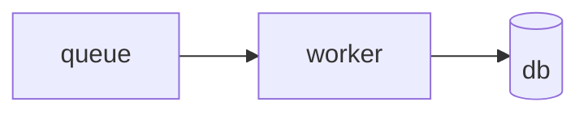

<div align="center">

# mdx-viewer

**Open an `.mdx` file the way you open a `.md` file.**

No site to scaffold, no framework to learn. One command previews it in a browser,
one command turns it into a single HTML file you can email.

[](https://www.npmjs.com/package/mdx-viewer)
[](https://nodejs.org)
[](https://mdxjs.com)
[](./LICENSE)

**English** · [简体中文](./README.zh-CN.md)

</div>

---

## Quick start

```bash
npm install -g mdx-viewer   # provides two commands: mdxv, mdxx
mdxv demo                   # see every component, live, in your browser
```

```bash
mdxv doc.mdx      # preview, hot-reloads as you edit
mdxv ./docs       # preview a whole directory, with navigation
mdxx doc.mdx      # export doc.html — self-contained, opens offline
```

Prefer not to install? `npx -p mdx-viewer mdxv doc.mdx`

## Why this exists

|  | |
|---|---|
| 📄 **Documents, not sites** | `.mdx` and `.md` are things you *open*. No Next.js or Docusaurus scaffold first. |
| 🎯 **Official MDX, not a dialect** | Built on `@mdx-js/rollup` (MDX v3), the reference compiler. CommonMark + JSX + `{}` expressions + ESM `import`/`export` parse to spec. |
| 🎨 **A template that already looks finished** | Semantic components (`<Callout>`, `<Steps>`, `<Hero>`…) need no import, and a CSS-variable theme with light/dark carries them. |
| 📦 **Export means offline** | One HTML file, **zero external links** — KaTeX fonts and the Mermaid runtime are base64-inlined. Double-click it on a plane. |

## Write this

````mdx
---
title: Deploy runbook
palette: teal
toc: true
---

<Callout tone="warn">Drain the queue before restarting.</Callout>

<Steps>
  <Step title="Scale down">Set replicas to 0 and wait for the drain.</Step>
  <Step title="Migrate">Run `bin/migrate --safe`.</Step>
</Steps>



The rate limit is $r = \frac{n}{t}$ requests per second.
````

Run `mdxv runbook.mdx`. No imports, no config, no build.

## The two commands

| Command | Does | Notes |
|---|---|---|
| `mdxv <file>` | Preview, rooted at the file's directory | Hot-reloads on save |
| `mdxv <dir>` | Preview the directory, opening the first doc | README/index preferred; left-hand nav appears |
| `mdxv demo` | Open the bundled component gallery | Every component and prop, live |
| `mdxv --check <file\|dir>` | Compile-check only — no server, no artifacts | Exit `0` pass / `1` a document failed / `2` could not check |
| `mdxv config set <key> <value>` | Write the user-level config | Creates it on first use |
| `mdxx <file> [out.html]` | Export one self-contained HTML | Zero external links |

Common flags: `--port <n>` `--host` `--no-open` `--lang <zh-CN\|en-US>` `--font-<role> <families>`.
Run `mdxv --help` for the full page, in your language.

**`mdxv` treats files and directories uniformly.** Both resolve to a single root plus a default
document — a file roots at its parent, a directory roots at itself. Multiple docs under the root
bring up navigation and make relative links cross-navigate; a single doc shows none.

### Check before you hand over a link

`mdxv` starting up does **not** mean your document compiles — MDX compiles lazily, when the browser
imports it. So a broken document still gets a green banner and a URL that 500s for whoever opens it.

```bash
mdxv --check ./docs    # one report line per document; report on stdout, errors on stderr
```

> [!IMPORTANT]
> A pass means the document **will open**, not that it is correct. It does not catch an undefined
> component, an invalid prop value, or malformed math — those load and render wrongly. Nor does it
> catch a top-level ESM statement or `{…}` expression that throws at evaluation or render time,
> which stops the document loading at all. These are examples, not an exhaustive list. An `import`
> inside a fenced code block is inert text, so documents *about* JavaScript are unaffected.

## Authoring

### Components, no import needed

Injected through `MDXProvider`, so `<Callout>` just works:

`Hero` `Section` `Callout` `Card` `Columns` `Toggle` `Steps`/`Step` `Stats`/`Stat` `Fields`/`Field`
`Scenario`/`When`/`And`/`Then` `Grid`/`Item` (filterable) `Badge` `Figure` `Math` `Code` `Footer`
`Colophon`

Props are semantic only — `tone`, `ratio`, `status` — never color values, so the theme stays in one
place. **To add one:** write a React component in `src/app/components/blocks.tsx`, add one row to
the map in `src/app/mdx-components.tsx`. The render pipeline is untouched.

### Diagrams, in three lanes

A fenced code block carries the diagram; the fence language picks the engine:

| Fence | Engine | Runtime cost |
|---|---|---|
| `dot` / `graphviz` | Graphviz (wasm) at build time → static SVG | none |
| `mermaid` | Rendered client-side, follows light/dark | loaded only when used |
| `svg` | Inlined as-is | none |

Every diagram gets a hover button that opens a fullscreen viewer: cursor-anchored wheel zoom,
drag-to-pan, and Esc to leave. Zooming changes the SVG's intrinsic size rather than applying a CSS
transform, so it stays vector-crisp at any magnification — in the preview and in the export alike.

### What MDX gives you, unmodified

| Capability | Implementation | Syntax |
|---|---|---|
| GFM (tables / task lists / strikethrough) | `remark-gfm` | native Markdown |
| Frontmatter (full YAML) | `remark-frontmatter` + `remark-mdx-frontmatter` | `--- … ---`, exported as `frontmatter` |
| Math | `remark-math` + `rehype-katex` | `$…$` / `$$…$$`, plus a `<Math tex=…>` extension |
| Syntax highlighting | `rehype-pretty-code` (Shiki) | ```` ```ts ````, dual theme, follows light/dark |

<details>
<summary><b>Frontmatter fields</b> — all optional, each renders only when present</summary>

<br>

| Field | Values |
|---|---|
| `title` `eyebrow` `subtitle` | Hero text |
| `author` `org` `copyright` `datetime` `footer` | Colophon; `datetime` is `yyyy-MM-dd HH:mm:ss` |
| `palette` | `indigo` `teal` `rose` `amber` `lime` |
| `mode` | `light` `dark` `auto` — the *initial* theme; the toolbar overrides and persists it |
| `density` | `comfortable` `compact` |
| `toc` | `true` shows a table of contents |
| `hero` | `false` disables the automatic Hero |
| `chrome` | `off` disables header, footer and colophon |

`toc: true` renders a fixed right-hand table of contents that is **hidden below a 1700px-wide
viewport**, so it never overlaps the prose — on a typical laptop you will not see it.

`datetime` is never generated for you. The colophon shows exactly what frontmatter says, in preview
and export alike. Only the copyright year `© <year>` comes from the current date.

</details>

<details>
<summary><b>Localized document variants</b> — one nav entry, two languages</summary>

<br>

Name sibling files with the locale immediately before the extension:

```text
guide.mdx          # base fallback
guide.zh-CN.mdx    # Simplified Chinese variant
guide.en-US.mdx    # English variant
```

The active UI language picks its exact variant first, then the unsuffixed base. Navigation shows one
logical `guide.mdx` entry rather than one per physical file. A localized `?doc=` URL is accepted and
normalized to the active language when that family has a match or a base fallback, and relative
Markdown links use the same family-aware routing.

Only the exact `.zh-CN` and `.en-US` suffixes are special; anything else is an ordinary filename.
`mdxx` stays a physical-file exporter — it exports the file you pass and never bundles siblings.

</details>

## Configuration

### Fonts

Set a font you own once, and every document uses it. The command creates the config file, and its
directory, on first use:

```bash
mdxv config set font.body "Iowan Old Style"
mdxv config set font.mono "Maple Mono, monospace"   # a comma names several families
```

That writes `~/.config/mdxv/config.json` (`$XDG_CONFIG_HOME` wins when absolute). Hand-editing is
equally fine — comments and trailing commas are tolerated:

```jsonc
{
  "font": {
    "body": "Iowan Old Style",            // body text
    "head": "Charter",                    // headings
    "mono": ["Maple Mono", "monospace"],  // code — an array works too
    // "sans": "..."                      // UI / toolbar
  },
}
```

Resolution order is fixed, for this and every setting the file will ever carry:

**CLI option → user config → built-in default**

```bash
mdxv doc.mdx --font-body "Zapfino"   # this run only
```

<details>
<summary><b>Four things worth knowing</b></summary>

<br>

- **It prepends, it does not replace.** Your font goes *ahead* of the built-in chain, so a missing
  glyph falls through. A Latin-only face takes over Latin and digits while CJK still falls back to
  the embedded Source Serif 4 and the system serif — you never write a fallback chain yourself.
- **`config set` never guesses.** It merges, keeping your other settings and any key it does not
  know. If the existing file cannot be understood — invalid JSON, a non-object at the top level — it
  refuses to write and says so rather than overwriting what it cannot read. Rewriting a commented
  file does drop the comments, and it tells you that too.
- **Both commands honor it**, so the preview shows the fonts the export will use. But the export
  records font **names** only and embeds no font files: the artifact stays free of external links,
  and a recipient without the font falls back down the chain. Identical glyphs for everyone would
  mean embedding the file — licensing and size implications, not supported.
- **A broken config never blocks a run.** A missing file is the normal case. An unreadable file,
  invalid JSON, a wrong field type or an illegal font name each print one `Warning:` line to stderr
  and fall back to the defaults. Font names allow only letters, digits, spaces and `. _ + -`; if any
  name in an entry is illegal the **whole** entry falls back rather than partly applying.

</details>

### Interface language and theme

The browser UI speaks Simplified Chinese and English, following the browser initially. The CLI uses
`--lang`, then `MDXV_LANG`, then the system locale. The toolbar's language control and its
`auto → light → dark` theme control persist manual choices in LocalStorage; in `auto`, the page keeps
following the operating system.

## Development

Requires **Node ≥ 20**. The CLI is plain `.mjs` that Node runs directly — no build step. The browser
app is `.tsx`, transpiled by Vite, with no separate `tsc` step.

```bash
make install       # npm install
make link          # optional: register mdxv / mdxx globally
make               # list every command
```

```bash
make view FILE=doc.mdx ARGS="--port 5000"
make export FILE=doc.mdx OUT=out.html
make check-mdx FILE=./docs
```

<details>
<summary><b>Repository layout</b></summary>

<br>

```
bin/          mdxv.mjs (preview) · mdxx.mjs (export)
src/
  cli/        input resolution · Vite config · virtual-module plugin · CLI language ·
              localized-doc families · user-level config (fonts) · terminal output
  mdx/        compile plugin list · three-lane diagram rehype plugin
  i18n/       supported locales · message catalog (product strings only)
  app/        React app: Layout · component library · theme.css ·
              MDXProvider mapping · preferences (language / theme)
demo/         index.mdx · index.zh-CN.mdx — the bundled component gallery
examples/     demo.mdx · guide/intro.md
test/         node --test suites (unit / integration / export smoke)
e2e/          Playwright specs + fixtures
```

**Preview** starts the Vite dev server programmatically: a single doc loads through the virtual
module `virtual:mdx-target`, while directory mode scans for `.md`/`.mdx`, serves `/__mdxv/tree`, and
lets the frontend load by `?doc=` and route relative links.

**Export** runs `vite build` with `vite-plugin-singlefile`, inlining every asset — KaTeX fonts and
the Mermaid runtime included — into one HTML file with no external references.

</details>

<details>
<summary><b>Testing</b> — zero third-party test dependencies</summary>

<br>

`test/` uses Node's built-in `node --test`. Browser behaviour lives in `e2e/`, driven by Playwright —
the only devDependency.

```bash
make test          # all node tests (unit + integration + export smoke; no e2e)
make test-unit     # L1: in-process, zero subprocesses (sub-second)
make test-cli      # L2: CLI subprocess contracts, no vite build
make test-build    # L3: everything needing a real vite build (slowest)
make test-e2e      # Playwright (first run: npx playwright install)
```

- **unit** — input resolution, localized-doc families, locale and message lookup, CLI language
  precedence, user config, terminal output. Fixtures built in a temp dir.
- **integration** — runs `mdxOptions()` through the official `@mdx-js/mdx` `compile()`, asserting
  frontmatter, GFM, math, highlighting and all three diagram lanes fire.
- **export smoke** — runs the real `mdxx` and asserts the output is zero-external-link and inlined.
- **e2e** — language and theme preferences and their persistence, localized variants, empty states.

</details>

## Contributing

This project is developed entirely by **VibeCoding**: shipped code is written by AI agents working
from a committed spec, under human review, using the
[ExcaliVibe](https://github.com/yanxuan-lc/excalivibe) capability suite. Every non-trivial change
lands with its `openspec/changes/<id>/` trail, so what was asked, what was decided and which gates
passed all stay reviewable.

You do not need to run an agent to take part — **a precise issue is a first-class contribution**,
because it is the brief the pipeline starts from. [CONTRIBUTING.md](./CONTRIBUTING.md) covers setup,
the development loop, the red lines (official MDX compatibility, zero-external-link export) and the
verification expected before a PR.

## Changelog

[CHANGELOG.md](./CHANGELOG.md) indexes every release, each entry linking to its GitHub release for
the full prose. Releases that change how existing documents render say so explicitly — see 0.3.0's
"what you may notice" for the shape those notices take.

## License

[MIT](./LICENSE) © yanxuan-lc
