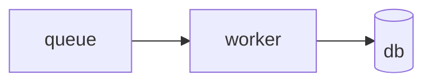

<div align="center">

# mdx-viewer

**像打开 `.md` 一样打开 `.mdx`。**

不搭站点工程,不学框架。一条命令在浏览器里预览,一条命令变成一个能发邮件的 HTML 文件。

[](https://www.npmjs.com/package/mdx-viewer)
[](https://nodejs.org)
[](https://mdxjs.com)
[](./LICENSE)

[English](./README.md) · **简体中文**

</div>

---

## 快速开始

```bash
npm install -g mdx-viewer   # 提供两个命令:mdxv、mdxx
mdxv demo                   # 在浏览器里看遍所有组件
```

```bash
mdxv doc.mdx      # 预览,编辑即热更新
mdxv ./docs       # 预览整个目录,带左侧导航
mdxx doc.mdx      # 导出 doc.html —— 自包含,离线可开
```

不想安装?`npx -p mdx-viewer mdxv doc.mdx`

## 为什么有它

|  | |
|---|---|
| 📄 **是文档,不是站点** | `.mdx` 和 `.md` 是拿来**打开**的东西,不必先搭一套 Next.js / Docusaurus 工程。 |
| 🎯 **官方 MDX,不是方言** | 底座是官方参考编译器 `@mdx-js/rollup`(MDX v3)。CommonMark + JSX + `{}` 表达式 + ESM `import`/`export` 全按官方标准解析。 |
| 🎨 **模板本来就是完成品** | 语义组件(`<Callout>`、`<Steps>`、`<Hero>`…)无需 import,一套 CSS 变量主题带明暗两色托住它们。 |
| 📦 **导出即离线** | 单个 HTML,**零外链** —— KaTeX 字体与 Mermaid 运行时全部 base64 内联。在飞机上双击也能开。 |

## 你写这些

````mdx
---
title: 上线手册
palette: teal
toc: true
---

<Callout tone="warn">重启前先把队列排空。</Callout>

<Steps>
  <Step title="缩容">副本数置 0,等待排空。</Step>
  <Step title="迁移">执行 `bin/migrate --safe`。</Step>
</Steps>



限流是 $r = \frac{n}{t}$ 次每秒。
````

然后 `mdxv runbook.mdx`。不用 import,不用配置,不用构建。

## 两个命令

| 命令 | 作用 | 说明 |
|---|---|---|
| `mdxv <file>` | 以文件所在目录为根预览 | 保存即热更新 |
| `mdxv <dir>` | 以该目录为根,打开首篇 | 优先 README/index;出现左侧导航 |
| `mdxv demo` | 打开内置组件总览 | 每个组件与参数都能实时看到 |
| `mdxv --check <file\|dir>` | 只做编译校验 —— 不起服务、不写产物 | 退出码 `0` 全通过 / `1` 有文档失败 / `2` 没法校验 |
| `mdxv config set <key> <value>` | 写用户级配置 | 首次运行时自动创建 |
| `mdxx <file> [out.html]` | 导出单文件自包含 HTML | 零外链 |

常用选项:`--port <n>` `--host` `--no-open` `--lang <zh-CN\|en-US>` `--font-<role> <families>`。
`mdxv --help` 有完整的、按你语言呈现的帮助页。

**`mdxv` 对文件和目录一视同仁**:两者都归结为「一个根目录 + 一篇默认文档」—— 文件以父目录为根,
目录以自身为根。根下有多篇时出现导航、相对链接可互跳;只有一篇时不显示导航。

### 把链接交出去之前先校验

`mdxv` 起得来**不等于**文档能编译 —— MDX 是惰性编译的,浏览器 import 时才编。所以坏掉的文档
照样给你一条绿色横幅,和一个别人一打开就 500 的地址。

```bash
mdxv --check ./docs    # 每篇一行报告;报告走 stdout,错误走 stderr
```

> [!IMPORTANT]
> 通过只意味着文档**能打开**,不意味着它是对的。它查不出未定义的组件、非法的属性值、写坏的数学
> 公式 —— 这些都能加载出来但渲染是错的;也查不出任何在模块求值 / 渲染期抛错的顶层 ESM 语句或
> `{…}` 表达式 —— 那会让文档根本加载不出来。这些只是例子,不是清单。围栏代码块里的 `import`
> 只是文本,所以讲 JavaScript 的文档不受影响。

## 写文档

### 组件,不用 import

经 `MDXProvider` 注入,`<Callout>` 直接就能写:

`Hero` `Section` `Callout` `Card` `Columns` `Toggle` `Steps`/`Step` `Stats`/`Stat` `Fields`/`Field`
`Scenario`/`When`/`And`/`Then` `Grid`/`Item`(可筛选) `Badge` `Figure` `Math` `Code` `Footer`
`Colophon`

参数只有语义值 —— `tone`、`ratio`、`status`,从不出现颜色值,配色始终只有一处来源。
**要加一个:**在 `src/app/components/blocks.tsx` 写个 React 组件,在
`src/app/mdx-components.tsx` 的映射表加一行。渲染管线一行都不用动。

### 图,三条车道

用标准围栏代码块承载,围栏语言决定引擎:

| 围栏 | 引擎 | 运行时开销 |
|---|---|---|
| `dot` / `graphviz` | 构建期 Graphviz(wasm)→ 静态 SVG | 无 |
| `mermaid` | 客户端渲染,跟随明暗主题 | 用到才加载 |
| `svg` | 原样内联 | 无 |

每张图都有一个悬停按钮打开**全屏查看器**:以光标为锚的滚轮缩放、拖拽平移、Esc 退出。缩放改的是
SVG 的固有尺寸而不是 CSS `transform`,所以放到多大都是矢量清晰的 —— 预览与导出物里都一样。

### MDX 原样给你的能力

| 能力 | 实现 | 写法 |
|---|---|---|
| GFM(表格 / 任务清单 / 删除线) | `remark-gfm` | 原生 Markdown |
| Frontmatter(完整 YAML) | `remark-frontmatter` + `remark-mdx-frontmatter` | `--- … ---`,导出为 `frontmatter` |
| 数学公式 | `remark-math` + `rehype-katex` | `$…$` / `$$…$$`,另有 `<Math tex=…>` 扩展 |
| 代码高亮 | `rehype-pretty-code`(Shiki) | ```` ```ts ````,双主题跟随明暗 |

<details>
<summary><b>Frontmatter 字段</b> —— 全部可选,写了才渲染</summary>

<br>

| 字段 | 取值 |
|---|---|
| `title` `eyebrow` `subtitle` | Hero 文案 |
| `author` `org` `copyright` `datetime` `footer` | 落款;`datetime` 为 `yyyy-MM-dd HH:mm:ss` |
| `palette` | `indigo` `teal` `rose` `amber` `lime` |
| `mode` | `light` `dark` `auto` —— **初始**主题,工具栏的切换会覆盖并记住 |
| `density` | `comfortable` `compact` |
| `toc` | `true` 显示目录 |
| `hero` | `false` 关闭自动 Hero |
| `chrome` | `off` 关闭页眉页脚与落款 |

`toc: true` 渲染的是右侧固定目录,并且在**视口宽度小于 1700px 时隐藏**,以免压住正文 ——
所以在常见的笔记本屏幕上你是看不到它的。

`datetime` 从不自动生成。落款显示的就是 frontmatter 里写的内容,预览与导出一致。只有版权年份
`© <年份>` 取自当前日期。

</details>

<details>
<summary><b>本地化文档变体</b> —— 一个导航条目,两种语言</summary>

<br>

把 locale 直接放在扩展名之前,给同级文件命名:

```text
guide.mdx          # 基础兜底
guide.zh-CN.mdx    # 简体中文变体
guide.en-US.mdx    # 英文变体
```

当前界面语言先选精确变体,再回落到无后缀的基础文档。导航里显示的是一个逻辑条目 `guide.mdx`,
而不是每个物理文件一条。带 locale 的 `?doc=` 地址也接受,并在该文件族有匹配变体或基础兜底时
归一到当前语言;相对 Markdown 链接走同一套按族路由的逻辑。

只有 `.zh-CN` 和 `.en-US` 这两个精确后缀是特殊的,其余都是普通文件名。`mdxx` 始终是物理文件
导出器 —— 你传哪个文件它导哪个,从不替你挑选或打包同族文件。

</details>

## 配置

### 字体

把你自己的字体设一次,所有文档都用它。配置文件(连同目录)在首次运行时创建:

```bash
mdxv config set font.body "霞鹜文楷"
mdxv config set font.mono "Maple Mono, monospace"   # 逗号分隔可给多个字体名
```

写入的是 `~/.config/mdxv/config.json`(`$XDG_CONFIG_HOME` 为绝对路径时以它为准)。手写这个文件
同样可以 —— 容忍注释与尾逗号:

```jsonc
{
  "font": {
    "body": "霞鹜文楷",                  // 正文
    "head": "思源宋体",                  // 标题
    "mono": ["Maple Mono", "monospace"], // 代码;也可以给一个数组
    // "sans": "..."                     // 界面/工具栏
  },
}
```

取值优先级是固定的,对这一项、以及这个文件将来承载的每一项都成立:

**CLI 参数 → 用户配置 → 内置默认**

```bash
mdxv doc.mdx --font-body "Zapfino"   # 只作用于本次运行
```

<details>
<summary><b>四件需要知道的事</b></summary>

<br>

- **是前置,不是替换。** 你的字体排在内置字体链**之前**,缺字形时自动往后落。拉丁字体只会接管
  拉丁与数字,中文仍走内嵌 Source Serif 4 与系统宋体兜底 —— 不用你手写一整条 fallback 链。
- **`config set` 从不替你猜。** 它只合并,你的其它设置与它不认识的字段都原样保留。已有文件读不懂
  时(不是合法 JSON、顶层不是对象),它拒绝写入并告诉你,而不是覆盖掉读不懂的内容。重写带注释的
  文件确实会丢注释,这一点它也会说一声。
- **两个命令都吃这份配置**,预览看到的字体就是导出物里的字体。但导出**只写字体名、不嵌字体
  文件**:产物仍然零外链,收件人没装这款字体时按兜底链回退。要让所有人看到完全一样的字形,
  得内嵌字体文件 —— 涉及授权与体积,目前不支持。
- **配置坏了不会阻断运行。** 文件不存在是正常情况;读不到、不是合法 JSON、字段类型不对、字体名
  非法,都只在 stderr 打一行 `警告:` 然后回退内置默认。字体名只允许字母、数字、空格与 `. _ + -`;
  一条里只要有一个非法名,**整条**回退,而不是部分生效。

</details>

### 界面语言与主题

浏览器界面支持简体中文与英文,初始跟随浏览器;CLI 侧依次看 `--lang`、`MDXV_LANG`、系统 Locale。
工具栏的语言控件与「自动 → 浅色 → 深色」主题控件会把手动选择记在 LocalStorage;处于「自动」时,
页面持续跟随操作系统的明暗变化。

## 开发

需要 **Node ≥ 20**。CLI 侧是纯 `.mjs`,Node 直接执行,没有构建步骤;浏览器应用是 `.tsx`,由 Vite
转译,没有独立的 `tsc` 步骤。

```bash
make install       # npm install
make link          # 可选:全局注册 mdxv / mdxx
make               # 列出全部命令
```

```bash
make view FILE=doc.mdx ARGS="--port 5000"
make export FILE=doc.mdx OUT=out.html
make check-mdx FILE=./docs
```

<details>
<summary><b>仓库结构</b></summary>

<br>

```
bin/          mdxv.mjs(预览) · mdxx.mjs(导出)
src/
  cli/        入参解析 · Vite 配置 · 虚拟模块插件 · CLI 语言 ·
              本地化文档族 · 用户级配置(字体) · 终端输出
  mdx/        编译插件清单 · 图三车道 rehype 插件
  i18n/       支持的 locale · 产品文案目录(只放产品串)
  app/        React 应用:Layout · 组件库 · theme.css ·
              MDXProvider 映射 · 偏好(语言 / 主题)
demo/         index.mdx · index.zh-CN.mdx —— 随包组件总览
examples/     demo.mdx · guide/intro.md
test/         node --test 测试集(单元 / 集成 / 导出冒烟)
e2e/          Playwright spec + fixtures
```

**预览**以编程方式起 Vite dev server:单篇经虚拟模块 `virtual:mdx-target` 加载;目录模式扫描
`.md`/`.mdx`、提供 `/__mdxv/tree`,前端按 `?doc=` 加载并路由相对链接。

**导出**跑 `vite build` + `vite-plugin-singlefile`,把所有资源 —— 含 KaTeX 字体与用到的 Mermaid
运行时 —— 全部内联进一个无任何外部引用的 HTML。

</details>

<details>
<summary><b>测试</b> —— 零第三方测试依赖</summary>

<br>

`test/` 用 Node 内置的 `node --test`。浏览器行为放在 `e2e/`,由 Playwright 驱动 —— 那是唯一的
devDependency。

```bash
make test          # 全部 node 测试(单元 + 集成 + 导出冒烟;不含 e2e)
make test-unit     # L1:进程内,零子进程(亚秒级)
make test-cli      # L2:CLI 子进程契约,不跑 vite 构建
make test-build    # L3:需要真实 vite 构建的(最慢)
make test-e2e      # Playwright(首次需 npx playwright install)
```

- **单元** —— 入参解析、本地化文档族、locale 与取词、CLI 语言优先级、用户配置、终端输出格式化。
  fixture 在临时目录现建现清。
- **集成** —— 把 `mdxOptions()` 喂给官方 `@mdx-js/mdx` 的 `compile()`,断言 frontmatter、GFM、
  数学、高亮与三条图车道都真的生效。
- **导出冒烟** —— 跑真实的 `mdxx`,断言产物零外链且资源已内联。
- **e2e** —— 语言与主题偏好及其持久化、本地化文档变体、空状态与错误态。

</details>

## 参与贡献

本项目完全由 **VibeCoding** 开发:发布的代码由 AI Agent 依据已提交的 spec 编写,经人工审查,
使用 [ExcaliVibe](https://github.com/yanxuan-lc/excalivibe) 能力套件。每个非平凡改动都连同它的
`openspec/changes/<id>/` 留痕一起落地,所以「提了什么、怎么决策、过了哪些门」全都可复查。

你不需要跑 Agent 才能参与 —— **一个精确的 issue 就是一等公民级的贡献**,因为它正是这条流水线
的起点。[CONTRIBUTING.md](./CONTRIBUTING.md) 讲了环境搭建、开发循环、项目红线(官方 MDX 兼容、
导出零外链)以及提 PR 前该做的验证。

## 更新日志

[CHANGELOG.md](./CHANGELOG.md) 是每次发布的索引,每条都链到对应的 GitHub Release 看完整叙述。
会改变已有文档渲染结果的发布会明确写出来 —— 0.3.0 的「what you may notice」就是这类提示的样子。

## 许可证

[MIT](./LICENSE) © yanxuan-lc
