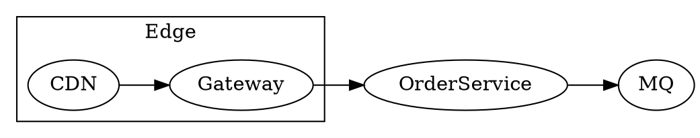
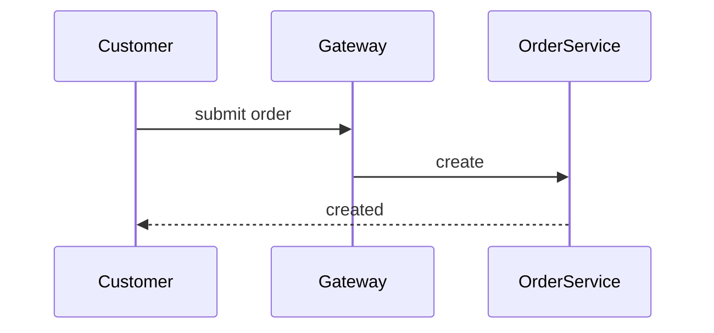

This page is a complete quick-reference for every component, prop, and supported pattern in mdx-viewer.

Use **Markdown whenever Markdown is enough**. Use components for rich blocks, layouts, interaction, mathematics, and diagrams. Components accept semantic props such as `tone`, `ratio`, and `status`; frontmatter controls the palette and color mode.

<Callout tone="info" title="How to read this gallery">

Each section describes the props first and then shows a runnable example. Export it with `mdxx demo/index.mdx`, or inspect this source file to see the MDX authoring form.

</Callout>

<Section number="00" eyebrow="frontmatter" title="Document metadata" />

YAML frontmatter at the top of a document controls the template and its appearance:

<Fields>
<Field k="title" v="Document title; it also creates the automatic Hero" />
<Field k="subtitle" v="The Hero subtitle" />
<Field k="author" v="Author or model shown in the colophon" />
<Field k="org" v="Organization shown beside the date in the Hero" />
<Field k="copyright" v="Copyright holder; the template adds © and the current year" />
<Field k="datetime" v="Document date/time in yyyy-MM-dd HH:mm:ss format" />
<Field k="footer" v="A message placed above the colophon" />
<Field k="palette" v="indigo | teal | rose | amber | lime" />
<Field k="mode" v="light | dark | auto; the toolbar can override it" />
<Field k="density" v="comfortable | compact" />
<Field k="toc" v="true shows the floating table of contents collected from Section" />
<Field k="hero" v="false disables the automatic Hero when an explicit Hero is present" />
<Field k="chrome" v="off removes the automatic header, footer, and colophon" />
</Fields>

<Section number="01" eyebrow="Markdown" title="Basic typography" />

Write normal Markdown and it is styled automatically: `## headings`, **bold**, *italic*, `inline code`, [links](https://mdxjs.com), and rules.

> A blockquote is useful for emphasis or quoted material.

- First unordered item
- Second unordered item
  - Nested item

1. First ordered item
2. Second ordered item

**GFM task list:**

- [x] Completed work
- [x] Another completed item
- [ ] Remaining work

| Command | Purpose | Note |
|---|---|---:|
| `mdxv <file>` | Preview one document | left |
| `mdxv <dir>` | Preview a directory | center |
| `mdxx <file>` | Export HTML | right |

<Section number="02" eyebrow="code" title="Code blocks and highlighting" />

Markdown fences safely contain angle brackets; Shiki uses the current color mode.

```ts
export async function placeOrder(input: OrderInput): Promise<Order> {
  const order = await db.orders.create(input);
  await mq.publish("order.created", order.id);
  return order;
}
```

The `<Code>` component adds a filename bar through its `filename` prop.

<Code filename="config.json">{`{ "port": 8080, "mode": "cluster" }`}</Code>

<Section number="03" eyebrow="math" title="LaTeX mathematics" />

The standard `$...$` and `$$...$$` syntax is handled by remark-math and KaTeX: inline $E = mc^2$, then display math:

$$
\text{QPS}_{\max} = \frac{N}{\bar{t}} \times \eta
$$

The `<Math>` component accepts a LaTeX `tex` string and optional `display="inline"`.

<Math tex="\int_0^\infty e^{-x}\,dx = 1" />

An inline value such as <Math tex="w = \frac{s}{c}" display="inline" /> can sit inside a sentence.

<Section number="04" eyebrow="feedback" title="Callout blocks" />

<Callout tone="info" title="Information">

Use this for contextual explanation.

</Callout>

<Callout tone="success" title="Success">

The operation completed and the indicators look healthy.

</Callout>

<Callout tone="warning" title="Warning">

An **idempotency** risk needs attention before release.

</Callout>

<Callout tone="danger" title="Danger">

This action is irreversible and deletes production data.

</Callout>

<Section number="05" eyebrow="cards" title="Card" />

Card accepts optional `tone`, `title`, `badge`, and `badgeTone`.

<Columns ratio="1:1">
<Card title="Default card">Use a regular card for a concise explanation or nested components.</Card>
<Card tone="primary" title="Primary card" badge="v1.0" badgeTone="success">Use primary tone for emphasis and a badge for a corner label.</Card>
</Columns>

<Section number="06" eyebrow="layout" title="Columns" />

Columns accepts `ratio`: `1:1`, `2:1`, `1:2`, or `1:1:1`. Each direct child is a column and narrow screens stack them.

<Columns ratio="2:1">
<Card title="Main column">This wider column is for main content.</Card>
<Card title="Side column">Use the narrow column for supporting detail.</Card>
</Columns>

<Columns ratio="1:1:1">
<Card title="Column one">An equal third.</Card>
<Card title="Column two">An equal third.</Card>
<Card title="Column three">An equal third.</Card>
</Columns>

<Section number="07" eyebrow="metrics" title="Stats" />

Stat accepts `value`, `label`, optional `delta`, and `dir`; put multiple statistics in Stats.

<Stats>
<Stat value="1.2M" label="daily orders" delta="+8%" dir="up" />
<Stat value="240ms" label="P99 latency" delta="-12%" dir="down" />
<Stat value="99.95%" label="availability" />
</Stats>

<Section number="08" eyebrow="flow" title="Steps" />

Step accepts `title` and optional `status`; its children are the description.

<Steps>
<Step title="Place the order" status="done">Validate inventory and price.</Step>
<Step title="Take payment" status="active">Call the payment gateway and await its callback.</Step>
<Step title="Fulfil">Create a fulfilment record and notify the warehouse.</Step>
</Steps>

<Section number="09" eyebrow="key-values" title="Fields" />

Fields show key/value pairs.

<Fields>
<Field k="runtime" v="Node 20 / TypeScript" />
<Field k="storage" v="MySQL 8 + Redis" />
<Field k="deploy" v="Kubernetes · three replicas" />
</Fields>

<Section number="10" eyebrow="disclosure" title="Toggle" />

Toggle accepts `title` and boolean `open`.

<Toggle title="Open this for supporting detail">

Any Markdown or component can live in a disclosure.

<Fields>
<Field k="SLO" v="Service level objective" />
<Field k="SLA" v="Service level agreement" />
</Fields>

</Toggle>

<Toggle title="An initially open disclosure" open>

Set `open` to begin expanded.

</Toggle>

<Section number="11" eyebrow="behavior" title="Scenario" />

Scenario accepts a title; use one or more When, And, and Then child nodes.

<Scenario title="Scenario: a customer submits an order">
<When>The customer selects Submit and stock is available</When>
<And>The payment channel is available</And>
<Then>Create the order and return a created state</Then>
</Scenario>

<Section number="12" eyebrow="collection" title="Filterable Grid" />

Grid accepts boolean `filterable` and `facets="id:Label,id:Label"`. Item accepts space-separated `tags` matching those facet ids.

<Grid filterable facets="desc:Descriptive,diag:Diagnostic,pred:Predictive">
<Item tags="desc">Trend analysis</Item>
<Item tags="desc diag">Funnel analysis</Item>
<Item tags="diag">Root-cause analysis</Item>
<Item tags="pred">Churn prediction</Item>
<Item tags="desc pred">Retention prediction</Item>
</Grid>

<Section number="13" eyebrow="inline" title="Badge" />

Badge accepts `tone` and boolean `dot`. Current status <Badge tone="success" dot>live</Badge>, rollout <Badge tone="warning">in progress</Badge>, old version <Badge tone="danger" dot>retired</Badge>, and a default <Badge>label</Badge>.

<Section number="14" eyebrow="figure" title="Figure" />

Figure accepts `caption` and wraps an image or any diagram:

<Figure caption="Figure 1: quarterly growth (custom SVG bars)">

```svg
<svg viewBox="0 0 260 140" width="320" role="img" aria-label="Quarterly growth bar chart">
  <line x1="20" y1="118" x2="244" y2="118" stroke="currentColor" stroke-opacity="0.3"/>
  <rect x="36" y="82" width="34" height="36" rx="4" fill="var(--accent)" fill-opacity="0.55"/>
  <rect x="90" y="62" width="34" height="56" rx="4" fill="var(--accent)" fill-opacity="0.7"/>
  <rect x="144" y="40" width="34" height="78" rx="4" fill="var(--accent)" fill-opacity="0.85"/>
  <rect x="198" y="20" width="34" height="98" rx="4" fill="var(--accent)"/>
</svg>
```

</Figure>

<Section number="15" eyebrow="diagrams" title="Three diagram lanes" />

Fenced code blocks select the engine.

**dot (Graphviz)** creates structural and architectural SVG at build time with zero runtime:



**mermaid** renders sequence diagrams, state machines, and Gantt charts in the browser:



**svg** is the escape hatch and is inlined unchanged; currentColor and var(--accent) follow the page theme:

```svg
<svg viewBox="0 0 220 130" width="280" role="img" aria-label="Node relationship diagram">
  <g stroke="currentColor" stroke-opacity="0.35" stroke-width="1.5">
    <line x1="40" y1="65" x2="110" y2="30"/>
    <line x1="40" y1="65" x2="110" y2="100"/>
    <line x1="110" y1="30" x2="180" y2="65"/>
    <line x1="110" y1="100" x2="180" y2="65"/>
  </g>
  <g fill="var(--accent)">
    <circle cx="40" cy="65" r="12"/>
    <circle cx="110" cy="30" r="12"/>
    <circle cx="110" cy="100" r="12"/>
    <circle cx="180" cy="65" r="14" fill="var(--accent-2)"/>
  </g>
</svg>
```

<Section number="16" eyebrow="header" title="Hero" />

When frontmatter has a title, mdx-viewer creates the automatic Hero at the top of this page. You can also write one explicitly; set `hero: false` to avoid two Heroes.

<Hero eyebrow="design · v1" title="Explicit Hero example" sub="A header written with a component" date="2026-07-23 · mdx-viewer" stats={[{v:"18",l:"built-in components"},{v:"5",l:"palettes"},{v:"3",l:"diagram lanes"}]}>
Explain what this document is and who it serves in one sentence.
</Hero>

<Section number="17" eyebrow="appearance" title="Palette and color mode" />

- **Palette:** frontmatter palette accepts indigo, teal, rose, amber, or lime and changes only the accent family.
- **Color mode:** mode accepts light, dark, or auto; the top-right button can override it and redraws diagrams and code highlighting.
- **Density:** compact reduces type size and leading for information-dense pages.

<Callout tone="success" title="That is everything">

These are all built-in components. To add another, write a React component in src/app/components/blocks.tsx and register one mapping line in src/app/mdx-components.tsx; the core MDX pipeline stays unchanged.

</Callout>
