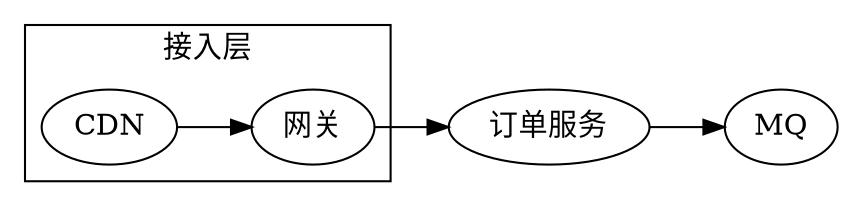
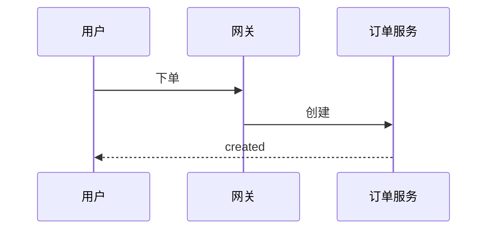

本页覆盖 mdx-viewer 支持的**全部组件、参数与写法**，可作为速查手册。右侧目录（宽屏可见）按组件分节索引。

原则：**能用 Markdown 就用 Markdown**；富块 / 布局 / 交互 / 公式 / 图用组件。样式只用语义参数（`tone` / `ratio` / `status` 等），不写颜色值——配色由 frontmatter 的 `palette` 与明暗决定。

<Callout tone="info" title="怎么读这份文档">

每节先给**参数说明**，再给**可运行示例**。想看源码写法，用 `mdxx demo/index.zh-CN.mdx` 导出后对照，或直接看 `demo/index.zh-CN.mdx`。

</Callout>

<Section number="00" eyebrow="frontmatter" title="文档元信息" />

文档顶部的 YAML frontmatter 驱动模板骨架与主题：

<Fields>
<Field k="title" v="文档标题（有则自动生成 Hero 头部）" />
<Field k="subtitle" v="副标题" />
<Field k="author" v="撰写此文档的模型 / 作者（落款用；缺失告警并兜底）" />
<Field k="org" v="组织名称，与日期时间一起用于 Hero 展示" />
<Field k="copyright" v="版权方；模板自动补充 © 和当前年份" />
<Field k="datetime" v="文档日期时间，格式 yyyy-MM-dd HH:mm:ss，用于 Hero 与落款" />
<Field k="footer" v="页脚寄语（显示在落款之上）" />
<Field k="palette" v="indigo | teal | rose | amber | lime" />
<Field k="mode" v="light | dark | auto（右上角可手动切换）" />
<Field k="density" v="comfortable | compact" />
<Field k="toc" v="true 显示右侧悬浮目录（从 Section 收集）" />
<Field k="hero" v="false 关闭自动 Hero（当你在正文显式写 <Hero> 时用）" />
<Field k="chrome" v="off 关闭自动头尾与落款" />
</Fields>

<Section number="01" eyebrow="Markdown" title="基础排版" />

标准 Markdown 直接写，自动上妆：`## 标题`、**粗体**、*斜体*、`行内码`、[链接](https://mdxjs.com)、`---` 分隔线。

> 引用块：这是一段 blockquote，用来强调或引用外部内容。

- 无序列表项一
- 无序列表项二
  - 嵌套项

1. 有序列表项一
2. 有序列表项二

**任务清单（GFM）：**

- [x] 已完成的事项
- [x] 另一件已完成
- [ ] 待办事项

**表格（GFM，支持对齐）：**

| 命令 | 作用 | 备注 |
|---|---|---:|
| `mdxv <file>` | 预览单篇 | 左 |
| `mdxv <dir>` | 预览目录 | 中 |
| `mdxx <file>` | 导出 HTML | 右对齐 |

<Section number="02" eyebrow="代码" title="代码块与高亮" />

**Markdown 围栏**（对 `<` `>` 安全，Shiki 双主题随明暗）：

```ts
export async function placeOrder(input: OrderInput): Promise<Order> {
  const order = await db.orders.create(input);
  await mq.publish("order.created", order.id);
  return order;
}
```

**`<Code filename>`** —— 带文件名栏。参数：`filename`。含裸 `<`（如泛型）时请改用 Markdown 围栏。

<Code filename="config.json">{`{ "port": 8080, "mode": "cluster" }`}</Code>

<Section number="03" eyebrow="数学" title="公式（LaTeX）" />

官方 `$...$` / `$$...$$` 语法（remark-math + KaTeX）：行内 $E = mc^2$，块级：

$$
\text{QPS}_{\max} = \frac{N}{\bar{t}} \times \eta
$$

**`<Math>`** 扩展组件。参数：`tex`（LaTeX 字符串）、`display`（`inline` 转行内，默认块级）。

<Math tex="\int_0^\infty e^{-x}\,dx = 1" />

行内变体：库存水位 <Math tex="w = \frac{s}{c}" display="inline" /> 需大于阈值。

<Section number="04" eyebrow="提示" title="Callout 提示块" />

参数：`tone`（`info` | `success` | `warning` | `danger`）、`title`。**内容需空行分隔**才按 markdown 段落渲染。

<Callout tone="info" title="信息">

一般性说明，用于补充上下文。

</Callout>

<Callout tone="success" title="成功">

操作已完成，指标符合预期。

</Callout>

<Callout tone="warning" title="警告">

存在**幂等性**风险，需在上线前处理。

</Callout>

<Callout tone="danger" title="危险">

此操作不可逆，会删除生产数据。

</Callout>

<Section number="05" eyebrow="卡片" title="Card 卡片" />

参数：`tone`（可选 `primary` | `info` | `success` | `warning` | `danger`）、`title`、`badge`、`badgeTone`（右上角角标）。

<Columns ratio="1:1">
<Card title="默认卡片">

普通内容卡片，承载一段说明或嵌套组件。

</Card>
<Card tone="primary" title="主色卡片" badge="v1.0" badgeTone="success">

用 `tone="primary"` 强调，右上角带 `badge` 角标。

</Card>
</Columns>

<Section number="06" eyebrow="布局" title="Columns 分栏" />

参数：`ratio`（`1:1` | `2:1` | `1:2` | `1:1:1`）。每个直接子块 = 一列，窄屏自动堆叠。

<Columns ratio="2:1">
<Card title="主区（宽）">

`ratio="2:1"`：左宽右窄，适合正文 + 侧栏。

</Card>
<Card title="侧栏（窄）">

补充信息。

</Card>
</Columns>

<Columns ratio="1:1:1">
<Card title="列一">三等分</Card>
<Card title="列二">三等分</Card>
<Card title="列三">三等分</Card>
</Columns>

<Section number="07" eyebrow="指标" title="Stats 指标卡" />

`Stat` 参数：`value`、`label`、`delta`（可选变化量）、`dir`（`up` | `down`，决定 delta 颜色）。多个包在 `<Stats>` 里。

<Stats>
<Stat value="1.2M" label="日均订单" delta="+8%" dir="up" />
<Stat value="240ms" label="P99 延迟" delta="-12%" dir="down" />
<Stat value="99.95%" label="可用性" />
</Stats>

<Section number="08" eyebrow="流程" title="Steps 步骤" />

`Step` 参数：`title`、`status`（`done` | `active` | 省略）；children = 描述。

<Steps>
<Step title="下单" status="done">校验库存与价格</Step>
<Step title="支付" status="active">调用支付网关，等待回调</Step>
<Step title="发货">生成履约单并通知仓储</Step>
</Steps>

<Section number="09" eyebrow="键值" title="Fields 字段表" />

`Field` 参数：`k`（键）、`v`（值）。

<Fields>
<Field k="runtime" v="Node 20 / TypeScript" />
<Field k="storage" v="MySQL 8 + Redis" />
<Field k="deploy" v="K8s · 3 副本" />
</Fields>

<Section number="10" eyebrow="折叠" title="Toggle 折叠块" />

参数：`title`、`open`（布尔，默认展开与否）。

<Toggle title="展开：默认折叠的补充说明">

折叠内容里可放任意 markdown 与组件。

<Fields>
<Field k="SLO" v="服务级目标" />
<Field k="SLA" v="服务级协议" />
</Fields>

</Toggle>

<Toggle title="默认展开的块" open>

`open` 为真时初始即展开。

</Toggle>

<Section number="11" eyebrow="用例" title="Scenario 场景" />

`Scenario` 参数：`title`；子标签 `<When>` / `<And>` / `<Then>`（各可多条）。

<Scenario title="Scenario: 用户提交订单">
<When>用户点击「提交」且库存充足</When>
<And>支付渠道可用</And>
<Then>创建订单并返回 created 状态</Then>
</Scenario>

<Section number="12" eyebrow="网格" title="Grid 可筛选网格" />

`Grid` 参数：`filterable`（布尔）、`facets="id:标签,id:标签"`（筛选维度）。`Item` 参数：`tags`（空格分隔，匹配 facet id）。点上方按钮筛选：

<Grid filterable facets="desc:描述性,diag:诊断性,pred:预测性">
<Item tags="desc">趋势分析</Item>
<Item tags="desc diag">漏斗分析</Item>
<Item tags="diag">根因定位</Item>
<Item tags="pred">流失预测</Item>
<Item tags="desc pred">留存预测</Item>
</Grid>

<Section number="13" eyebrow="行内" title="Badge 徽标" />

参数：`tone`（`info` | `success` | `warning` | `danger`）、`dot`（布尔，前置圆点）。写在散文里：

当前状态 <Badge tone="success" dot>已上线</Badge>，灰度 <Badge tone="warning">进行中</Badge>，旧版 <Badge tone="danger" dot>已下线</Badge>，默认 <Badge>标签</Badge>。

<Section number="14" eyebrow="图" title="Figure 图注" />

参数：`caption`（图下方居中标题）。包裹任意图或图片：

<Figure caption="图 1：季度增长（自定义 SVG 柱状图）">

```svg
<svg viewBox="0 0 260 140" width="320" role="img" aria-label="季度增长柱状图">
  <line x1="20" y1="118" x2="244" y2="118" stroke="currentColor" stroke-opacity="0.3"/>
  <rect x="36"  y="82"  width="34" height="36"  rx="4" fill="var(--accent)" fill-opacity="0.55"/>
  <rect x="90"  y="62"  width="34" height="56"  rx="4" fill="var(--accent)" fill-opacity="0.7"/>
  <rect x="144" y="40"  width="34" height="78"  rx="4" fill="var(--accent)" fill-opacity="0.85"/>
  <rect x="198" y="20"  width="34" height="98"  rx="4" fill="var(--accent)"/>
  <circle cx="53" cy="82" r="3" fill="var(--accent)"/>
  <circle cx="107" cy="62" r="3" fill="var(--accent)"/>
  <circle cx="161" cy="40" r="3" fill="var(--accent)"/>
  <circle cx="215" cy="20" r="3" fill="var(--accent)"/>
  <polyline points="53,82 107,62 161,40 215,20" fill="none" stroke="var(--accent)" stroke-width="1.5" stroke-dasharray="3 3" stroke-opacity="0.6"/>
</svg>
```

</Figure>

<Section number="15" eyebrow="图·车道" title="Diagram 三车道" />

图用 **fenced code block** 承载，围栏语言决定引擎。

**`dot`（Graphviz）** —— 结构 / 关系 / 架构图，构建期出静态 SVG，零运行时：



**`mermaid`** —— 时序 / 状态机 / 甘特等专用记法，客户端渲染：



**`svg`** —— 兜底逃生舱，原样内联；用 `currentColor` / `var(--accent)` 上色即随明暗：

```svg
<svg viewBox="0 0 220 130" width="280" role="img" aria-label="节点关系图">
  <g stroke="currentColor" stroke-opacity="0.35" stroke-width="1.5">
    <line x1="40" y1="65" x2="110" y2="30"/>
    <line x1="40" y1="65" x2="110" y2="100"/>
    <line x1="110" y1="30" x2="180" y2="65"/>
    <line x1="110" y1="100" x2="180" y2="65"/>
    <line x1="110" y1="30" x2="110" y2="100"/>
  </g>
  <g fill="var(--accent)">
    <circle cx="40" cy="65" r="12"/>
    <circle cx="110" cy="30" r="12"/>
    <circle cx="110" cy="100" r="12"/>
    <circle cx="180" cy="65" r="14" fill="var(--accent-2)"/>
  </g>
</svg>
```

<Section number="16" eyebrow="头部" title="Hero 头部" />

有 frontmatter `title` 时**自动生成** Hero（即本页顶部）。也可在正文显式写（此时建议 frontmatter 设 `hero: false` 避免重复）。参数：`eyebrow`、`title`、`sub`、`date`、`stats={[{v,l}]}`；children = 描述段。

<Hero eyebrow="design · v1" title="显式 Hero 示例" sub="用组件手写的头部" date="2026-07-23 · mdx-viewer" stats={[{v:"18",l:"内置组件"},{v:"5",l:"配色"},{v:"3",l:"图车道"}]}>
一句话说清这份文档是什么、给谁看。
</Hero>

<Section number="17" eyebrow="主题" title="配色与明暗" />

- **配色**：frontmatter `palette` 取 `indigo` / `teal` / `rose` / `amber` / `lime`，只改强调色一族。
- **明暗**：`mode` 取 `light` / `dark` / `auto`；右上角按钮可随时手动切换，图与代码高亮会跟随重渲。
- **密度**：`density: compact` 缩小字号行距，适合信息密集的看板。

<Callout tone="success" title="就这些">

以上即全部内置组件。扩展新组件只需在 `src/app/components/blocks.tsx` 写一个 React 组件，并在 `src/app/mdx-components.tsx` 登记一行——核心渲染管线无需改动。

</Callout>
