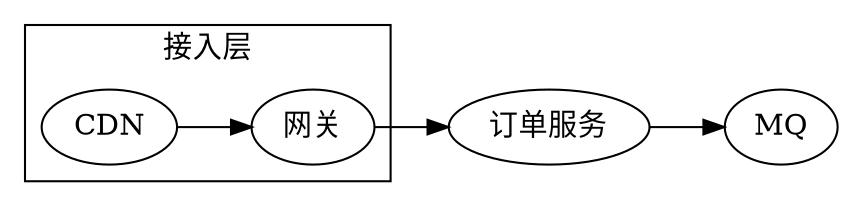
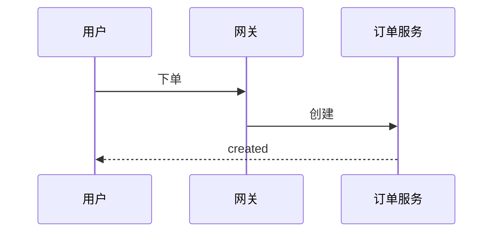

本方案面向后端团队，说明订单系统如何用消息队列做异步解耦。这里是**导语**，用来一句话交代文档目的。

<Section number="01" eyebrow="背景" title="目标与约束" />

我们需要在高峰期支撑百万级订单。核心约束如下：

- [x] 下单链路 P99 < 300ms
- [x] 支付回调幂等
- [ ] 灰度发布能力

| 指标 | 目标 | 当前 |
|---|---:|---:|
| 日均订单 | 1.2M | 0.9M |
| P99 延迟 | 300ms | 240ms |

<Callout tone="warning" title="风险">

支付回调存在**幂等性**问题，需在 T1 前解决。

</Callout>

<Stats>
<Stat value="1.2M" label="日均订单" delta="+8%" dir="up" />
<Stat value="240ms" label="P99 延迟" delta="-12%" dir="down" />
</Stats>

<Section number="02" eyebrow="流程" title="下单主链路" />

<Steps>
<Step title="下单" status="done">校验库存与价格</Step>
<Step title="支付" status="active">调用支付网关</Step>
<Step title="发货">生成履约单</Step>
</Steps>

行内公式 $E = mc^2$ 与块级公式：

$$
\text{QPS}_{\max} = \frac{N}{\bar{t}} \times \eta
$$

<Math tex="\int_0^\infty e^{-x}\,dx = 1" />

<Section number="03" eyebrow="架构" title="部署拓扑" />



<Figure caption="下单时序">



</Figure>

```ts
export async function placeOrder(input: OrderInput): Promise<Order> {
  return db.orders.create(input);
}
```

当前状态 <Badge tone="success" dot>已上线</Badge>。
