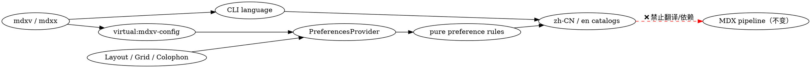

<Callout tone="warning" title="只读派生物 · 请勿直接编辑">

本文档由 spec（机器可读的设计产物）**单向派生**，仅供人工审查。修改意见请反馈给 planner
回流至 spec 后重新生成；直接编辑会产生第二份事实源。

</Callout>

<Fields>
<Field k="变更 ID" v="i18n-preferences" />
<Field k="生成时间" v="2026-07-25 01:34" />
<Field k="Spec 版本" v="931da52e7296" />
<Field k="关键度 / 自治档位" v="supporting / generic / reversible ｜ auto+spot-check" />
<Field k="Arch-review（AI 设计预审）" v="待执行：变更跨 CLI、浏览器与导出模块" />
<Field k="状态" v="⏳ 待人工评审（架构门）" />
</Fields>

| 层 / 契约 | 本变更是否涉及 | 章节 |
|---|---|---|
| ① 框定 | ✅ | ① |
| ②§0 领域模型 | 无新领域概念 | §0 |
| ②§1 模块设计 | ✅ | §1 |
| ②§2 接口设计 | ✅ CLI / 虚拟模块 / 浏览器状态 | §2 |
| ②§3 数据库设计 | 不涉及数据库；涉及 LocalStorage | §3 |
| ②§4 用例设计 | ✅ S1–S12 | §4 |
| ③ 关键决策 | ✅ 4 条 | ③ |
| ④ 横切质量 | ✅ 4 项 | ④ |

<Section number="01" eyebrow="框定" title="背景 · 目标 · 约束" />

**mdx-viewer** 是本地 MDX（Markdown + JSX）渲染器：`mdxv` 在浏览器预览文档，`mdxx` 导出零外链的单文件 HTML。变更把 CLI 与浏览器固定文案扩展为简体中文/英文，并把语言与三态主题偏好持久化。

| ✅ 目标 | ❌ 非目标 |
|---|---|
| `zh-CN` / `en` 两种产品语言；语言按钮更新固定文案与 `html.lang` | 自动翻译 MDX 正文、frontmatter、文件名或作者组件文本 |
| `auto` / `light` / `dark` 三态主题，保存后恢复 | 第三方国际化框架、远程翻译、CDN |
| `mdxv` / `mdxx` 的 `--lang`、环境变量与系统回退 | 新 REST/RPC/Event API 或数据库 |
| 离线导出继续零外链并保留交互 | 改动官方 MDX v3 编译兼容基线 |

<Section number="02" eyebrow="结构" title="领域模型与四契约" />

### §0 领域模型（Domain Model）

本变更无新业务领域概念；只有两个技术状态：Locale（产品语言）与 Theme Preference（主题偏好）。既有 MDX、frontmatter、虚拟模块和落款（Colophon）语义不变。

### §1 模块设计（Module Design）



| 增量 | 职责 |
|---|---|
| `src/i18n/locale.mjs`, `messages.mjs` | 两种 Locale、规范化、完整消息目录 |
| `src/cli/language.mjs` | `--lang` / `MDXV_LANG` / 系统 Locale / 英文解析 |
| `src/app/preferences.mjs` | 纯优先级与安全 LocalStorage 读写 |
| `src/app/PreferencesProvider.tsx` | React 状态、HTML 属性、系统主题监听 |
| 既有 CLI / Vite / Layout / Grid / Colophon | 仅接入上述稳定边界 |

### §2 接口设计（Interface Design）

CLI（Command-line Interface，命令行接口）契约：

```text
mdxv <file|dir> [--lang zh-CN|en] [...]
mdxx <file> [output.html] [--lang zh-CN|en]
MDXV_LANG=zh-CN|en mdxv|mdxx ...
```

| 消费面 | 优先级 / 形状 |
|---|---|
| CLI 自身语言 | `--lang` → `MDXV_LANG` → Node 系统 Locale → `en` |
| 浏览器语言 | 合法 `mv-locale` → CLI/env 初始值 → 浏览器主语言 → 系统提示 → `en` |
| 浏览器主题 | 合法 `mv-theme` → 合法 frontmatter `mode` → `auto` |
| 虚拟模块增量 | `{ initialLocale, localeSource }`，保留既有 `{ mode, firstDoc }` |

显式 CLI 值只接受精确的 `zh-CN` / `en`。非法 flag/env 返回本地化 `INVALID_LANGUAGE`、退出码 1，且不启动 server、不构建文件。产品拥有的固定文案双语；flag、路径、版本、许可证和作者内容不翻译。

主题按钮循环 `auto → light → dark → auto`。语言按钮循环 `zh-CN ↔ en`，位于主题按钮左侧。两种变化同步更新 `html` 属性和辅助功能（Accessibility, a11y）标签。

### §3 数据库设计（Database Design）

本变更不触碰数据库：无 ER 图、DDL、迁移、索引或数据库写入。唯一新增持久化（Persistence）如下：

| LocalStorage key | 合法原始字符串 | 回退 |
|---|---|---|
| `mv-locale` | `zh-CN`, `en` | CLI/env 初始值 → 浏览器 → 系统提示 → `en` |
| `mv-theme` | `auto`, `light`, `dark` | frontmatter 合法 `mode` → `auto` |

读写异常全部捕获；写入失败时本标签页状态仍生效，刷新恢复不保证。非法旧值被忽略且不自动改写。既有 `mv-nav-collapsed` / `mv-nav-open` 不迁移。

### §4 用例设计（Use Cases）

<Callout tone="success" title="确认本节 = 确认验收口径（Acceptance Criteria）">

执行载体为 **scripted（脚本化）**：Playwright 覆盖浏览器，Node 子进程覆盖 CLI，`node:test` 覆盖纯规则，真实 Vite build 覆盖导出。所有场景无数据库写入。

</Callout>

| ID | WHEN | THEN | LocalStorage |
|---|---|---|---|
| S1 | 无保存/强制值，浏览器为简体中文 | 中文产品 UI，`html.lang=zh-CN` | 无写入 |
| S2 | 无保存/强制值，浏览器非简体中文 | 英文产品 UI，`html.lang=en` | 无写入 |
| S3 | 点击语言按钮并刷新 | 固定文案与 lang 同步切换并保持 | 写 `mv-locale` |
| S4 | 主题按钮遍历三态并逐次刷新 | 偏好、实际主题、标签均正确并保持 | 写 `mv-theme` |
| S5 | auto/手动状态下改变系统明暗 | 仅 auto 实时跟随 | 无新增写入 |
| S6 | 无保存主题，加载合法/非法/缺失 mode | 合法 mode 生效；其余 auto | 无写入 |
| S7 | 损坏值或 LocalStorage 抛错 | 不崩溃，走默认，内存切换可用 | 非法值不改写 |
| S8 | 两种语言触发全部固定消息族 | 键集相同、译文完整、无串语 | 仅主动切换写入 |
| S9 | 两个 CLI 执行优先级/非法矩阵 | 来源正确；非法本地化且退出 1 | 无写入 |
| S10 | `mdxx --lang en` 后离线打开、切换、刷新 | 零资源请求，交互与恢复正常 | 写两个偏好 key |
| S11 | 含中英作者内容时切语言 | 作者内容不变，仅 chrome 变化 | 仅写 locale |
| S12 | 跑全部现有与新增套件 | MDX、导航、相对链接、导出无回归 | 按场景限定 |

<Section number="03" eyebrow="审议" title="关键决策（ADR）— 评「合理性」看这里" />

| 决策 | 选定 | 主要代价 |
|---|---|---|
| D1 语言优先级 | 保存值优先；CLI/env 只给无保存值的初始语言 | 新的 `--lang` 要清除旧偏好才可见 |
| D2 本地化实现 | 两份自有小消息目录 + 原始字符串 key | 未来高级复数/日期规则需扩展 |
| D3 主题状态 | 偏好存 auto/light/dark，DOM 另存解析后的 light/dark | 两份状态必须严格同步 |
| D4 验收载体 | Playwright + Node + 真实 Vite build | 增加开发测试依赖和执行时间 |

<Section number="04" eyebrow="横切" title="质量视角（每项给可测场景）" />

- **失败与一致性（Failure & Consistency）**：当 LocalStorage 不可用，页面不崩溃且当前页切换生效；度量为零未捕获异常。代价是刷新后不保证恢复。
- **兼容与互操作（Compatibility & Interoperability）**：当运行既有 MDX/目录/导出套件，全部继续通过且产物无外链；代价是不得把翻译接入 MDX AST。
- **性能与容量（Performance & Capacity）**：消息目录随单文件内联，不产生网络请求；初始属性在首个可见渲染前确定。代价是两份短文案增加少量包体。
- **安全与信任边界（Security & Trust Boundary）**：LocalStorage 与 CLI 都是不可信输入，只接受白名单值；插值按文本渲染。度量为非法值不执行、不注入 HTML、不阻断页面。

<Footer>

**深究指针**：执行级四契约 → `openspec/changes/i18n-preferences/design.md`；规范场景 → `openspec/changes/i18n-preferences/specs/i18n-preferences/spec.md`；实施拆分 → `openspec/changes/i18n-preferences/tasks.md`。

**请逐项确认**：① 范围准确？② 保存语言优先于新的 CLI 初始值、浏览器简体中文识别与主题三态合理？③ LocalStorage key 与不可用时降级可接受？④ S1–S12 的脚本化验收足以放行实现？

</Footer>
