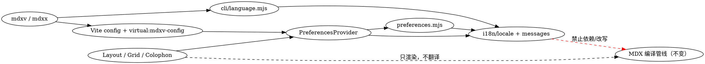

## Context

mdx-viewer 是本地 MDX 渲染器：`mdxv` 启动 Vite 预览，`mdxx` 用同一应用入口构建自包含离线 HTML。当前 CLI、导航、目录、空状态、错误、辅助功能标签和 Grid 默认项混有硬编码中文，主题只在当前页面内切换 light/dark，`<html lang>` 固定为 `zh-CN`。

本变更跨越 CLI、`virtual:mdxv-config`、React 模板和单文件导出，但不改变官方 MDX v3 编译管线、作者内容或任何数据库。设计以 AGENTS.md 中的既有术语 MDX、frontmatter、虚拟模块和落款（Colophon）为准。

## Goals / Non-Goals

**Goals:**

- CLI 与浏览器固定产品文案完整支持 `zh-CN`、`en`。
- 明确定义语言和主题的解析、持久化、非法值回退及运行时状态变化。
- `mdxv`、`mdxx` 共享同一语言解析器和消息目录。
- 导出 HTML 保持零外链、可离线，并保留切换与持久化。
- 用稳定场景 ID 和脚本化载体覆盖主路径及验收阻断型异常路径。

**Non-Goals:**

- 不翻译 MDX 正文、frontmatter 值、文件名、目录名、作者传入组件文本或 demo 内容。
- 不支持 `zh-CN`、`en` 之外的产品语言，不引入语言包下载、第三方 i18n 框架或远程服务。
- 不改变 `mv-nav-collapsed`、`mv-nav-open` 的既有导航状态语义。
- 不改变 MDX 编译插件、图三车道或对外 HTTP/RPC/Event API。

## Four Contracts

### 1. Project structure & module design

目录增量（🟢 新增，🟡 修改）：

```text
bin/
  mdxv.mjs                         🟡 预解析语言、注册 --lang、本地化 CLI 输出、注入语言提示
  mdxx.mjs                         🟡 同上；构建自包含 HTML
src/
  i18n/
    locale.mjs                     🟢 Locale 常量、严格/宽松规范化、消息取值
    messages.mjs                   🟢 zh-CN/en 完整消息目录
  cli/
    language.mjs                   🟢 --lang / MDXV_LANG / 系统语言的 CLI 边界解析
    resolve.mjs                    🟡 以稳定错误码而非中文字符串暴露预期输入错误
    vite-config.mjs                🟡 传递 initialLocale 与 localeSource
    plugin.mjs                     🟡 扩展 virtual:mdxv-config
  app/
    preferences.mjs                🟢 纯函数：浏览器语言/主题优先级与安全 LocalStorage 访问
    PreferencesProvider.tsx        🟢 React 状态、HTML 属性、系统主题监听与消息上下文
    main.tsx                       🟡 provider、空状态与渲染错误本地化
    Layout.tsx                     🟡 语言按钮、三态主题、导航/TOC/aria 文案
    components/blocks.tsx          🟡 Grid 默认筛选项
    components/client.tsx          🟡 落款固定措辞与辅助功能标签
    global.d.ts                    🟡 虚拟模块类型
    styles/theme.css               🟡 语言按钮与三态主题控件样式
test/
  locale.test.mjs                  🟢 纯解析、目录完整性、损坏值回退
  cli-language.test.mjs            🟢 子进程级 CLI 矩阵
  export.test.mjs                  🟡 自包含与注入断言
e2e/
  i18n-preferences.spec.mjs        🟢 Playwright 浏览器状态流（由 e2e-author 编写）
```

允许的依赖方向：



职责与公共形状：

| 模块 | 唯一职责 | 公共形状 |
|---|---|---|
| `i18n/locale.mjs` | 定义受支持 Locale 并提供无副作用规范化 | `SUPPORTED_LOCALES`, `normalizeSystemLocale`, `isLocale`, `t` |
| `i18n/messages.mjs` | 存放产品拥有的消息；两目录键集必须完全相同 | `MESSAGES` |
| `cli/language.mjs` | 在 Node 边界读取 argv/env/Intl，严格校验显式值 | `resolveCliLanguage(...) -> { locale, source }`；预期错误带 `code` |
| `app/preferences.mjs` | 不依赖 React 的优先级与安全存储读写 | `resolveBrowserLocale`, `resolveThemePreference`, `readPreference`, `writePreference` |
| `PreferencesProvider.tsx` | 持有 locale/theme preference，更新 DOM，向 UI 暴露 `t` 与切换动作 | `usePreferences()`；只包裹产品 chrome，不改写作者节点 |

`.mjs` 公共函数使用 JSDoc 描述参数、返回值和预期错误；`.tsx` 导出 provider/hook 使用明确类型。新逻辑不得用字符串匹配错误消息、不得新增跨模块循环依赖，也不得把 LocalStorage/DOM 副作用放进消息目录。

### 2. External protocol / CLI contract

#### 2.1 CLI

```text
mdxv <file|dir> [--lang zh-CN|en] [--port <n>] [--host] [--no-open]
mdxx <file> [output.html] [--lang zh-CN|en]
MDXV_LANG=zh-CN|en mdxv <file|dir>
MDXV_LANG=zh-CN|en mdxx <file> [output.html]
```

CLI 自身的有效语言按下表解析；显式值只接受大小写完全匹配的 `zh-CN` 或 `en`：

| 优先级 | 来源 | 规则 |
|---:|---|---|
| 1 | `--lang` | 合法即选中；非法立即报 `INVALID_LANGUAGE`，不降级到下层 |
| 2 | `MDXV_LANG` | 仅在没有 `--lang` 时读取；合法即选中，非法立即报错 |
| 3 | Node 系统 Locale | `Intl.DateTimeFormat().resolvedOptions().locale`；`zh-CN`、`zh-SG`、`zh-Hans` 前缀映射 `zh-CN`，其余映射 `en` |
| 4 | 兜底 | 系统 Locale 缺失/不可读时为 `en` |

非法 `--lang` 的错误语言取“忽略该非法值后的下一合法层”；非法 `MDXV_LANG` 的错误语言取系统 Locale/英文。预期错误格式为 `✗ <本地化消息>\n`、退出码 `1`、不打印堆栈。有效 CLI 的帮助描述、启动/导出状态和产品拥有的错误文本使用已选 Locale；命令、flag、路径、版本、许可证、MDX/frontmatter 原文不翻译。

| 错误码 | 触发 | 退出码 | 参数 |
|---|---|---:|---|
| `INVALID_LANGUAGE` | 选中的 `--lang` 或 `MDXV_LANG` 不在允许集合 | 1 | `value`, `allowed` |
| `INPUT_REQUIRED` | 缺失输入路径 | 1 | `command` |
| `INPUT_NOT_FOUND` | 路径不存在/不可读取 | 1 | `path` |
| `INPUT_NOT_MDX` | 文件扩展名不是 `.md`/`.mdx` | 1 | `path` |
| `DIRECTORY_EMPTY` | `mdxv` 目录无可显示文档 | 1 | `root` |
| `EXPORT_REQUIRES_FILE` | `mdxx` 收到目录 | 1 | `path` |

示例：

```text
$ mdxv docs --lang en --no-open
  mdx-viewer v1.0.0
  Root /work/docs (3 documents) · Opening /work/docs/README.md
  → http://localhost:4321/?doc=...

$ MDXV_LANG=zh-CN mdxx docs/readme.mdx out.html
✓ /work/out.html  (123 KB，自包含)

$ mdxv docs --lang fr
✗ Unsupported language "fr"; expected zh-CN or en.
```

#### 2.2 虚拟模块与浏览器状态

`virtual:mdxv-config` 是内部构建协议，不是网络 API；其完整形状变为：

```jsonc
{
  "mode": "file",              // "file" | "dir"
  "firstDoc": "/abs/doc.mdx",  // 可缺失
  "initialLocale": "en",       // CLI 解析后的 Locale
  "localeSource": "argument"   // "argument" | "environment" | "system" | "fallback"
}
```

浏览器有效 Locale 按如下顺序解析：

1. LocalStorage `mv-locale` 的合法值；
2. `localeSource` 为 `argument` 或 `environment` 时的 `initialLocale`；
3. 浏览器主语言 `navigator.languages[0]`（缺失则 `navigator.language`）：简体中文标识 `zh-CN`/`zh-SG`/`zh-Hans*` 映射 `zh-CN`，其他语言（含 `zh-Hant`/`zh-TW`）映射 `en`；
4. `localeSource` 为 `system`/`fallback` 时的 `initialLocale`；
5. `en`。

保存偏好优先是为了恢复用户上次在页面内的明确选择；`--lang`/环境变量只规定“无保存偏好时”的初始值。语言切换按 `zh-CN ↔ en`，同步更新产品文案、`document.documentElement.lang` 和 `mv-locale`。按钮可见短标签为目标语言（中文界面显示 `EN`，英文界面显示 `中`），`aria-label` 用当前 Locale 描述切换目标。

浏览器主题偏好按如下顺序解析：

1. LocalStorage `mv-theme` 的合法值；
2. 当前文档 frontmatter `mode` 的合法值；
3. `auto`。

合法主题偏好仅为 `auto`、`light`、`dark`；按钮循环为 `auto → light → dark → auto`。偏好写入 `mv-theme`，并以 `data-theme-preference` 暴露原始偏好；实际 CSS 主题仍以 `data-theme=light|dark` 暴露。`auto` 立即按 `(prefers-color-scheme: dark)` 解析并持续监听变化，手动 light/dark 必须移除该监听。Locale、主题和 `<html>` 属性应在应用首次可见渲染前完成初始化，避免先显示错误语言/主题。

消息目录必须覆盖：

| 界面族 | 固定文案 |
|---|---|
| 导航/TOC | 文件标题、菜单、关闭、目录 |
| 空状态/错误 | 选择文档、目录为空、找不到文档、MDX 渲染失败 |
| 控件与 a11y | 语言切换、三种主题名称/切换动作、菜单/关闭辅助标签 |
| 组件 | Grid 默认“全部”筛选项 |
| 落款 | Edited by/on 等固定连接词、GitHub 推广链接辅助标签 |
| CLI | help 描述、输入错误、启动摘要、导出成功/失败 |

两份目录键集必须完全一致；缺键在测试/开发时是失败，不允许静默回落到另一语言。插值只替换消息参数，不解释为 HTML。

本变更不新增 REST、RPC 或事件端点。既有 `GET /__mdxv/tree` 的请求、响应和错误行为不变。

### 3. Database & persistence design

本变更不接触数据库：无 ER 实体、无 DDL、无迁移、无数据库索引或数据库写入。浏览器 LocalStorage 是唯一新增持久化面：

| Key | 编码 | 合法值 | 写入时机 | 缺失/非法/读取异常 |
|---|---|---|---|---|
| `mv-locale` | 原始 UTF-16 字符串，不用 JSON | `zh-CN`, `en` | 用户点击语言按钮后 | 忽略并走语言优先级；页面不得崩溃 |
| `mv-theme` | 原始 UTF-16 字符串，不用 JSON | `auto`, `light`, `dark` | 用户点击主题按钮后 | 忽略并走 frontmatter/auto；页面不得崩溃 |

LocalStorage 的 `getItem`/`setItem` 均在安全边界捕获异常（例如被禁用或 `file://` 环境限制）。写入失败时当前标签页的内存状态仍立即生效，但刷新后允许按默认规则重算；产品不得声称已持久化成功，也不得为此阻断渲染。非法旧值不自动改写，直到用户进行有效选择。

导航现有 key 不迁移：

```text
mv-nav-collapsed   # 既有 LocalStorage，保持不变
mv-nav-open        # 既有 sessionStorage，保持不变
```

### 4. Use cases & e2e scenarios

执行载体：**scripted**。S1–S8、S10–S11 由 Playwright 在本地 Vite 页面执行并直接断言 DOM、media query 与 LocalStorage；S9 由 Node `node:test` 子进程执行；S6–S8 另有纯函数/目录键集单测；S10/S12 复用真实 Vite 导出冒烟。所有场景均无数据库写入，测试必须显式断言相应 LocalStorage 写入或“无写入”。

| ID | WHEN（用户动作/条件） | THEN（可观察结果） | 持久化影响 | 载体 |
|---|---|---|---|---|
| S1 | 清空偏好，无 CLI/env 强制值，以浏览器主语言 `zh-CN` 打开预览 | 导航抽屉等产品 UI 为中文，`html.lang=zh-CN` | DB 无；两个偏好 key 均不写 | Playwright |
| S2 | 同上，以 `en-US` 或非简体中文主语言打开 | 产品 UI 为英文，`html.lang=en` | DB 无；两个偏好 key 均不写 | Playwright |
| S3 | 点击语言按钮并刷新 | 所有已渲染固定文案和 `html.lang` 同步切换；刷新后保持 | `mv-locale` 写目标 Locale | Playwright |
| S4 | 连续点击主题按钮经过三种偏好并逐次刷新 | `data-theme-preference` 按循环变化；每一步 `data-theme` 正确 | `mv-theme` 每次写当前偏好 | Playwright |
| S5 | 在 auto 与手动模式分别模拟系统明暗变化 | auto 实时变化；light/dark 保持不变 | 不新增写入 | Playwright |
| S6 | 无保存主题，分别加载合法/非法/缺失 frontmatter mode | 合法值生效；非法/缺失为 auto | 不写 `mv-theme` | unit + Playwright |
| S7 | 注入非法 key 值并模拟 LocalStorage 抛错后加载/切换 | 页面不崩溃，按默认规则显示；内存切换仍生效 | 非法值不被自动改写；失败写入不抛到 UI | unit + Playwright |
| S8 | 在两种 Locale 下逐一触发导航、TOC、空状态、错误、a11y、Grid 与落款 | 每类固定文案有对应译文，目录键集相同且无另一语言泄漏 | 仅语言切换写 `mv-locale` | unit + Playwright |
| S9 | 对两个命令执行 `--lang`/env/系统矩阵及非法值 | 输出语言和虚拟配置来源符合优先级；非法值本地化、退出 1、未启动/未构建 | DB/LocalStorage 均无写入 | node:test subprocess |
| S10 | `mdxx --lang en` 导出、断网后打开、切换语言/主题并刷新 | 单文件零外链，正文可读，初始英文，切换和可用 LocalStorage 环境中的刷新恢复正常 | 写 `mv-locale`/`mv-theme`；DB 无 | export smoke + Playwright |
| S11 | 在包含中英正文、frontmatter、文件名和组件文本的页面切换语言 | 作者内容逐字节/逐节点保持不变，只有产品 chrome 改变 | 仅 `mv-locale` 写入 | Playwright |
| S12 | 运行现有编译、目录导航和导出套件 | 全部通过；官方 MDX 语法、相对链接和自包含约束无回归 | 按现有 fixture；DB 无 | existing scripted suites |

完整 WHEN/THEN 规范见 `specs/i18n-preferences/spec.md`；稳定 ID S1–S12 不得在 e2e 映射建立后复用或重排。

## Decisions

### D1 — 把 CLI 显式选择视为浏览器“初始值”，保存偏好仍优先

| 方案 | 优点 | 代价 |
|---|---|---|
| `--lang` 永远覆盖 LocalStorage | 每次命令完全确定 | 用户在页面内切换后刷新会被命令重置，违背“恢复偏好” |
| 浏览器永远忽略 CLI | 浏览器规则单纯 | `--lang` 无法控制预览/导出初始 UI |
| **选定：保存值 > CLI/env 初始值 > 浏览器 > 系统提示** | 同时满足恢复与 CLI 初始控制；浏览器语言仍在无强制值时生效 | 用户要清除旧选择后才能观察新的 `--lang` 初始值 |

### D2 — 原始字符串 key + 纯函数解析，不引入 i18n 框架

| 方案 | 优点 | 代价 |
|---|---|---|
| 第三方 i18n/偏好库 | 生态完整 | 增包体与导出复杂度，本需求仅两种语言 |
| JSON 偏好对象 | 将来可扩展 | 单字段损坏会影响整包，迁移成本提前发生 |
| **选定：两个原始字符串 key + 自有小消息目录** | 可审计、易容错、零运行依赖 | 复数/日期等高级本地化能力需未来另加 |

### D3 — 主题存“偏好”，DOM 存“解析结果”

`mv-theme` 与 `data-theme-preference` 保存 `auto|light|dark`，`data-theme` 只保存 CSS 消费的 `light|dark`。代价是两份状态需同步，但能让 auto 在不改写用户偏好的前提下持续响应系统变化。

### D4 — 浏览器状态流采用 Playwright 脚本化验收

纯函数单测无法证明 `<html lang>`、media query 监听、刷新恢复和导出离线交互。Playwright 增加开发期测试依赖与执行时间，但它是该 UI 状态流的直接可重复载体；不把这些场景降为人工/agent-driven。

## Risks / Trade-offs

- [LocalStorage 在隐私模式或某些 `file://` 实现中不可用] → 所有读写捕获异常，当前标签页继续工作；S7 验证不崩溃，S10 在支持 LocalStorage 的离线浏览器环境验证刷新恢复。
- [React 挂载后才应用偏好会闪现错误主题/语言] → 在首次可见渲染前用同一纯解析函数设置 `lang`、`data-theme-preference`、`data-theme`，provider 接管后不得二次改变解析结果。
- [消息新增只补一门语言] → 目录键集相等测试为阻断项，不允许运行时跨语言静默回退。
- [auto media listener 重复注册] → provider 在每次偏好变化时清理旧 listener；手动模式断言系统变化不影响主题。
- [本地化错误吞掉真实路径原因] → 预期错误用稳定 code + 参数；非预期 cause 保留给顶层日志，但不做字符串匹配。
- [Playwright 增加测试时长] → 纯解析留在快速 `node:test`，浏览器套件只覆盖稳定场景，真实导出继续单列。

## Migration Plan

1. 先新增共享 Locale/消息/偏好纯函数与单测，再让 CLI 和 React 消费。
2. 扩展虚拟模块为向后兼容的附加字段；`mode`、`firstDoc` 不改名。
3. 用新 provider 替换现有临时 `useTheme`/`ThemeToggle`，接入固定产品文案。
4. 增加 CLI、浏览器和导出验收，再运行完整现有套件。
5. 无数据迁移；新 key 初始缺失即按默认规则解析。回滚时删除新增模块与入口接线即可，已写 key 被旧版本忽略。

## Open Questions

无。LocalStorage 不可用时的“当前标签页生效但不保证刷新恢复”是浏览器能力降级，不是待定产品决策。

## Glossary conformance

仓库不存在 `CONTEXT.md`，因此 glossary-conformance 无法给出机械 `pass`；本设计没有据此主张正确性。命名改用 AGENTS.md 已登记的 MDX、frontmatter、虚拟模块、落款（Colophon）及其现有 `mv-*` 约定；新增的 Locale、主题偏好属于技术状态名，未引入新的核心领域词。
