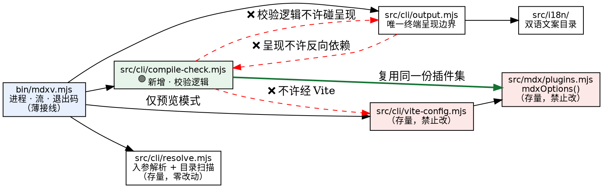

<Callout tone="warning" title="只读派生物 · 请勿直接编辑">

本文档由 spec（机器可读的设计产物）**单向派生**，仅供人工审查。修改意见请反馈给 planner
回流至 spec 后**重新生成**——直接编辑会产生第二份事实源。

</Callout>

<Fields>
<Field k="变更 ID" v="mdx-compile-check" />
<Field k="生成时间" v="2026-07-28 01:11" />
<Field k="Spec 版本" v="ae985fb62629" />
<Field k="关键度 / 自治档位" v="supporting / feature / reversible ｜ auto+spot-check" />
<Field k="Arch-review（AI 设计预审）" v="✅ 两轮均已闭环 —— 第 1 轮 13 项（含 3 项 P0）＋ 第 2 轮 1 项新发现，全部消化；第 2 轮结论为 GO" />
<Field k="Code-review（合并前评审）" v="✅ 两项判定均 HELD，零 P0/P1；两条文本类 P2（#A2 自相矛盾 · #A3 边界读作封闭集）已在本版消化" />
<Field k="实施与验收" v="✅ e2e 18/18 · npm test 118/118 · security / perf 门 PASS" />
<Field k="状态" v="⏳ 待人工评审（架构门）" />
</Fields>

本文档分四层：① 框定 → ② 结构（四契约）→ ③ 审议（关键决策的备选与权衡）→ ④ 横切（质量视角）。

| 层 / 契约 | 本变更是否涉及 | 章节 |
|---|---|---|
| ① 框定 | ✅ | 01 |
| ②§0 领域模型 | 无新领域概念（纯工具能力） | §0 |
| ②§1 模块设计 | ✅ 新增 1 个模块 + 3 处接线 | §1 |
| ②§2 接口设计 | ✅ **载重契约**：命令行接口，且跨仓库 | §2 |
| ②§3 数据库设计 | **本变更不涉及**（项目无数据库） | §3 |
| ②§4 用例设计 | ✅ 19 个场景 | §4 |
| ③ 关键决策 | ✅ 7 条 | 03 |
| ④ 横切质量 | ✅ 触发 5 项 | 04 |

<Callout tone="info" title="两轮 AI 设计预审改了什么（相对最初的人审稿）">

**第 1 轮**判定「先修 spec 再开工」，13 项 finding 已全部消化。**四项最要紧的**：

1. **原方案的校验会误报**——它对每篇都按 MDX 解析，于是普通 `.md`（含 `README.md`）里完全正常的
   写法会被判失败。已改为按扩展名逐篇推导格式（见 D1）。**对一道门来说，假失败比假通过更坏。**
2. **原方案承诺过强**——「通过 = 一定能打开」字面不成立。已收紧为单向保证，并把两档非检出写进
   帮助文案（见 §2）。
3. **原方案的报告会被染色 / 被截断**——两个会让消费方 grep 失效的实现陷阱，已写成规范要求。
4. **原方案 `--lang` 写错时会退「文档破了」**——正是分档退出码要消灭的混淆，已修。

**第 2 轮结论 GO**，并抓到一项两个修法之间的**相互作用**：为第 1 轮的问题①选定的方案，
恰好让第 1 轮为问题「引擎自己坏了怎么归档」设计的那条路径**在现实中不可能发生**——
于是那条规范要求只能靠一个测试替身来「通过」。已删除该场景与它要求的生产代码接缝（见 D7）。
**一条只有测试替身能见证的要求，等于把虚假覆盖当成真覆盖。**

</Callout>

<Section number="01" eyebrow="框定" title="背景 · 目标 · 约束" />

**mdx-viewer** 是一个本地 MDX 渲染器。MDX 是「Markdown + JSX 组件」的文档格式——把 Markdown
写法和可复用组件混在一起。它提供两个命令：`mdxv` 起一个本地开发服务器在浏览器里预览文档，
`mdxx` 把单篇文档导出成零外链、可离线双击打开的单文件 HTML。

**问题（实测，非推测）**：`mdxv` **启动成功不代表文档能编译**。MDX 编译是**懒的**——只在浏览器
真正请求那个文档的瞬间才发生。所以对一份编译不过的文档，`mdxv` 依然打印一片绿的
「✓ Preview ready」面板、进程常驻、退出码正常；破损只在浏览器请求文档时拿到 HTTP 500 才暴露。

<Callout tone="danger" title="这个变更要消灭的失败模式">

一个自动产出文档的 AI agent 跑完 `mdxv`，看到全绿输出，就把本地预览地址交给用户——
**用户打开才发现整页是错误**。本次触发案例：一份流程产出的文档，硬折行把一段形如
`` `<global|tenant|workspace>` `` 的文本顶到了行首，MDX 于是按 JSX 标签去解析它，报
`` Unexpected character `|` (U+007C) in name ``。

</Callout>

现有的替代手段是拿导出命令当门禁——`mdxx doc.mdx out.html`，破损时确实退出码非 0。但代价有两条：
它要跑一整轮生产构建（实测 **3.77 秒**），而且错误被吞成一句「Export failed」，**拿不到出错的行列号**。

| ✅ 目标 | ❌ 非目标（本可做、显式排除） |
|---|---|
| 新增 `mdxv --check` 模式：只判「这份文档能不能编译」 | 不判组件是否存在、属性值是否合法、排版是否好看 |
| 毫秒级；精确到 `行:列`；退出码可直接当门禁（gate）用 | 不做 `--json` 结构化输出（当前无消费方，避免投机扩展） |
| 支持单文件与目录（目录递归、逐篇报告） | 不给导出命令 `mdxx` 加同名开关（一处足够） |
| 校验必须与真实渲染管线**同源**，否则门是假的 | 不改动 `mdxv` 预览与 `mdxx` 导出的既有行为 |
| —— | **不**加宽到「模块引用是否可解析」（用户本轮裁定，见 D6） |

**约束（Constraints）**

1. **双端一致性硬约束**：编译插件清单（`src/mdx/plugins.mjs`）与 Vite 配置构建器
   （`src/cli/vite-config.mjs`）由预览与导出两条路径**共用**。本变更**一行都不许改它们**。
2. **跨仓库契约**：另一个仓库的文档产出 skill 将在交付前调用本命令当门禁——**开关名、退出码语义、
   输出流分工一旦被它硬编码即成对外契约**，所以这三项必须写成规范要求，不能算实现细节。
3. 报错文案走项目既有的双语文案目录（简体中文 / 英文）。

<Section number="02" eyebrow="结构" title="四契约" />

### §0 领域模型（Domain Model）

**本变更无新业务领域概念**——它是一个纯工具能力（tooling capability）。唯一引入的新概念是
「编译校验（compile check）」：对一篇文档只做「能否编译」的判定。项目术语表尚未登记该词，
收尾时补登记。

### §1 模块设计（Module Design）

新增一个模块，三处接线；两个共享模块显式不动。



绿色粗箭头是本设计的**要点**：校验走的插件集，和真实渲染管线拿的是**同一个** `mdxOptions()`。
红色虚线是禁止方向。

| 模块 | 职责 | 明确不做 |
|---|---|---|
| `bin/mdxv.mjs` ✏️ | 读参数、分流、写流、设退出码 | 不含编译逻辑、不含格式化 |
| `src/cli/compile-check.mjs` 🟢 | 读文件、编译、把失败归一为结构化结果 | 不打印、不退出进程、不本地化 |
| `src/cli/output.mjs` ✏️ | 报告行 / 汇总行 / 路径显示 / 着色判定 / 帮助页 | 不读文件、不编译 |
| `src/cli/resolve.mjs` | 复用其入参解析与目录递归扫描 | **本变更零改动** |
| `src/mdx/plugins.mjs` ❌ | 被复用的**输入** | **禁止修改**（约束 1） |
| `src/cli/vite-config.mjs` ❌ | 校验模式完全不经过它 | **禁止修改**（约束 1） |

**新模块的公开面**（就两个，其中一个是纯函数——把最容易出错的分支单测掉）：

```js
/** 把一次编译异常归一成可呈现的位置与原因（纯函数，无 I/O）。 */
export function describeCompileFailure(error)   // → { line?, column?, reason }

/** 顺序校验一批文档；单篇失败不中断其余。 */
export async function checkDocuments(documents, { onResult })
// → { results, passed, failed }
```

`onResult` 让接线层边算边打印（长目录有进度感），同时保持校验逻辑不碰流。其契约被写死：
按输入顺序对每篇**恰好调用一次**，返回的 `results` **只用于聚合**、不得二次打印——否则会出现
重复行与顺序错乱。

**公开面刻意没有第三个**：不设「可替换的编译函数」这类测试接缝（第 2 轮预审的结论，见 D7）。
校验与真实渲染管线走同一套编译，正是这道门的全部价值；而一个可替换编译函数的接缝，
恰好是让二者悄悄漂移的机制——即便只对内也不该有。

### §2 接口设计（Interface Design）

<Callout tone="danger" title="这是本变更的载重契约，且是跨仓库的">

另一个仓库的文档产出 skill 会**硬编码**下面的开关名、三档退出码与输出流分工。
一旦发布就难改——**请重点评这一节**。

</Callout>

```text
mdxv --check <file|dir|demo> [--lang <zh-CN|en-US>]
```

**开关交互**

| 开关 | 校验模式下的行为 |
|---|---|
| `--check` | 布尔开关，出现即进入校验模式 |
| `--lang` | **生效**（决定汇总行与错误文案的语言）；但它自身写错时算**用法错误**，退 2 |
| `--port` / `--host` / `--no-open` | **接受但忽略**——它们是服务器选项，而校验不起服务器。可机检的不变量：不占用任何端口、进程自行退出 |
| `--help` / `--version` | 优先于 `--check` |
| 未注册选项 / 缺值 / 多余参数 | 用法错误 → 退出码 2 |

> 将来所有 check 专属选项统一用 `--check-*` 前缀，这样开关命名空间能扩展，不必再谈一次跨仓库契约。

**输入 → 文档集**（校验没有「默认文档」概念）

| 输入 | 文档集 |
|---|---|
| 一个文件 | 恰好该篇 |
| 一个目录 | 递归扫描全部 `.md` / `.mdx`，按路径排序 |
| `demo`（随包内置示例） | 该目录下**全部 2 篇**——可自检发行物 |
| 缺失 / 不存在 / 非 MDX 文件 / **空目录** | 用法错误 → 退出码 2 |

**退出码（exit code）契约——消费方靠它分流**

| 码 | 含义 | 消费方该做什么 |
|---|---|---|
| `0` | 文档集非空，且全部编译通过 | 可以起预览、可以交付 |
| `1` | 至少一篇没通过 | **文档破了** → 去修文档 |
| `2` | **根本没能执行校验** | **我调用错了** → 去修调用 |

退出码 2 的完整清单：一切参数级失败（**含 `--lang` 非法 / 缺值 / 给两次**）、路径缺失 / 不存在 /
非 MDX 文件、**直接指名的那个文件读不出来**、空目录。**没有第五项**——特别是引擎故障不在其中，见下。

退出码 2 **只在**带 `--check` 时出现；不带 `--check` 的既有命令仍退 1，既有规范基线不回归。
空目录归 2 而非 0 是**刻意的**：零文档静默通过正是本变更要消灭的假门——打错目录反而拿到绿灯。

<Callout tone="warning" title="引擎自己坏了会归到「文档破了」——这是已知且刻意接受的归因缺陷">

若图表引擎或语法高亮引擎在某台机器上装坏 / 加载失败，那一篇会被打成 `✗` 并计入退出码 1，
原因文本是引擎的报错而不是文档的问题。**归因是错的，但判定不是错的**——理由见 D7
（校验与真实渲染共用同一套引擎，所以那台机器上文档确实也打不开）。
一度设计过「引擎故障单独归一档退出码」，第 2 轮预审证明那条路径在当前方案下**不可能发生**，
已删除。区分手段是**原因文本**，与「文件读不出来」那一档的既有做法一致。

</Callout>

<Callout tone="info" title="一处刻意的不对称，写下来免得被当成漏网">

**直接指名**一个读不出的文件 → 退 **2**（一篇都没校验到，就是「没能执行校验」）。
同样的物理状况发生在**被扫描目录内部** → 退 **1**（其余文档确实被校验了，而读不出的那篇不能算
「已知良好」，门不能放行）。

</Callout>

**输出流分工**（消费方的 grep 依赖它）

| 内容 | 流 |
|---|---|
| 逐篇 `✓` / `✗` 行、汇总行 | **标准输出（stdout）** |
| `Error:` 诊断（+ 用法错误时的完整帮助页） | **标准错误（stderr）** |

即：**报告是主产物 → stdout；「我调用错了」→ stderr**。消费方重定向后只 grep 报告，
而标准错误非空即表示调用姿势不对。

<Callout tone="warning" title="报告改走标准输出之后，两个必须处理的后果">

这两条单独任何一条都会让消费方的 grep 失效，所以都被写成了规范要求而非实现建议：

1. **着色必须按「实际写入的那条流」分别判定。** 现有命令行只有一个全局着色开关，依据是
   **标准错误**是不是终端。而在推荐给消费方的那条调用里（报告重定向进文件、错误留在终端），
   标准错误**仍是终端**——复用那个开关就会把 ANSI 颜色码写进被捕获的报告里。消费方随后会用一条
   「剥离颜色码」的正则绕过去，那条正则就成了跨仓库契约的一部分，以后想去掉颜色反而变成破坏性变更。
2. **不得强制退出进程。** 报告是逐篇增量输出的；当标准输出是**管道**时，强制退出会丢弃尚未写完的
   数据。「退出码正确 + 报告被截断」对一道门是最坏形状：消费方拿到「有文档破了」，却拿到一份不完整的清单。

</Callout>

**报告行格式**

```text
✓ path/to/ok.mdx
✗ path/to/bad.mdx:115:8  Unexpected character `|` (U+007C) in name, expected a name …
✗ path/to/bad-dot.mdx  syntax error in line 2          ← 异常不带位置信息时
2 passed, 1 failed                                     ← 仅当文档集 >1 篇
```

- 路径相对当前工作目录；若相对形式会向上逃逸则打绝对路径。原样输出、不着色，保持可复制。
- 行列号 1-based；位置与原因之间**两个空格**；原因**完整**输出、不截断。
- 只有 `✓` / `✗` 着绿 / 红。

**为什么必须有「无位置」分支**——实测三种异常形状：

| 触发 | 行 / 列 | 原因文本 |
|---|---|---|
| 行首出现 `` `<a\|b\|c>` `` 形状的文本 | `2` / `8` ✅ | ``Unexpected character `\|` …`` |
| 未闭合的组件标签 | **无** ⚠️ | `Expected a closing tag for …`（位置在文本里） |
| 图表围栏（Graphviz `dot`）语法错 | **无** | `syntax error in line 2`（**图源的行号，不是文档的**——不得当成文档位置） |

#### 这道门承诺什么、不承诺什么

这道门是**单向可靠**的。把这件事说清楚比含糊过去更有用：

| 方向 | 强度 |
|---|---|
| **失败 ⇒ 一定渲染不出来** | 可靠（前提是 D7 成立：引擎故障必须归 2，否则「退 1」不再唯一意味着文档破了） |
| **通过 ⇒ 编译期无错** | 必要但**不充分** |

「通过」实际保证的是：语法可解析、frontmatter 是合法 YAML、`dot` 图表**真的**在编译期成图
（坏图确实被挡——这条保证不小）。它**不**保证文档能加载。两档非检出：

| 档 | 后果 | 判据 |
|---|---|---|
| **甲** | 页面能打开，只是不对 | 未定义组件（渲染期清晰报错）、非法属性值（静默失效）、坏公式（渲染成错误节点） |
| **乙** | **整篇加载 / 渲染失败** | **机制**：任何**顶层 ESM 语句**或 `{…}` 表达式在**模块求值 / 渲染期**失败 —— 例如引用目标不存在、标识符未定义、**或初始化器自身抛错** |

帮助文案必须**点名乙档**——乙档才是击穿「过了就能交付」这个用法的那一类。

<Callout tone="danger" title="乙档必须写成「机制 + 举例」，不能写成封闭清单">

合并前评审（code-review #A3）指出：原措辞**没说假话**（帮助文案的引导句「只校验编译、不保证文档
能加载」本身是真的），但那份**没有「例如」标记的两项清单会被理性读者当成穷举**，于是推出
「我这篇既没 import 也没 `{…}` 表达式，那么通过 = 可交付」—— 而打掉这个推理正是这条要求存在的
全部目的。两个实测反例：

```text
export const boom = (() => { throw new Error("x") })()   → --check 退 0，浏览器里模块求值即炸
{(() => { throw new Error("y") })()}                      → --check 退 0，渲染期即炸
```

乙档的机制**天然开放**：每一种乙档形状都按定义在编译期不可见，所以任何清单都不可能完备。
用户裁定本轮就改（而不是记账到下次）。

</Callout>

<Callout tone="warning" title="新查明的事实：乙档并不是「导出命令能兜住」——只有一半">

我原先未写明这点，本轮实测补上（2026-07-28）：

| 乙档形状 | `--check` | 导出命令 | 失败时机 |
|---|---|---|---|
| 引用目标不存在 | 0 | **1** | 构建期（打包器解析引用） |
| 顶层初始化器抛错 | 0 | **0** | 模块求值期（浏览器） |
| `{…}` 表达式抛错 | 0 | **0** | 渲染期（浏览器） |

即：只有**构建期子集**能被导出命令见证。**求值期子集两条命令都放行**，导出命令甚至会产出一个
「打开就炸」的自包含 HTML。所以这一档的唯一见证方式是**真的打开文档**。
规范因此禁止把针对导出命令的配对断言扩到求值期形状（那样断言就是假的），
并用 **S20** 以「两条命令都退 0」的配对把这条边界钉住。

</Callout>

<Callout tone="danger" title="乙档措辞的一处关键纠正（实测确认）">

必须写「**顶层 ESM `import` 语句**」，**绝不能**写成笼统的「import」。围栏代码块里的 `import`
是**惰性文本**，不是语句：

| 写法 | 导出命令实测 |
|---|---|
| 顶层 `import Thing from "./does-not-exist.js"` | 退 1（乙档，真的打不开） |
| 同样两行 import，但写在 js 围栏里 | 退 **0**（完全正常） |

「写文档来讲 JavaScript」是本项目的主要用法之一，措辞不得把它牵连进去。**给将来的注记**：
若日后要加宽到检查引用目标，实现必须读语法树节点，**绝不能**文本匹配行首的 `import`——那会把
每一份含 JS 围栏的文档误判为失败，与 D1 修掉的是同一类假失败事故。

</Callout>

### §3 数据库设计（Database Design）

**本变更不涉及数据库**：项目无数据库、无持久化、无建表语句、无迁移。
校验模式还额外承诺**零产物**——不落 HTML、不落缓存、不落临时目录（可机检要求，见 S7）。

### §4 用例设计（Use Cases）

<Callout tone="success" title="确认本节 = 确认验收口径（Acceptance Criteria）">

下列 19 个场景全部通过 = 本变更验收完成。**执行载体（execution carrier）= 脚本化（scripted）**：
纯函数单测 + 子进程调用真实命令行的断言。**不用 Playwright**——本变更没有浏览器界面。
分两条测试车道：S12 要跑一整轮真实导出（约 3.8 秒），单独放慢车道，不污染「快单测」那条。

</Callout>

| ID | WHEN（触发） | THEN（可观察断言） | 退出码 |
|---|---|---|---|
| S1 | 单篇能编译的文档 | stdout 恰为 `✓ 路径`，stderr 空，**无**汇总行 | 0 |
| S2 | 单篇：行首 `` `<a\|b\|c>` `` 形状文本（**触发本变更的 bug 类**） | `✗ 路径:行:列` + 两空格 + 以 ``Unexpected character `\|` (U+007C) in name`` 开头的原因 | 1 |
| **S13** | 同一份字节相同的内容，分别命名 `.md` 与 `.mdx` | **`.md` 报通过**（markdown 把它当文本，预览也能渲染）；`.mdx` 报失败。两个方向都钉住 | 0 / 1 |
| S3 | 目录，通过与失败混合 | 每篇一行、按路径排序，末尾 `N passed, M failed` | 1 |
| S4 | 目录，全部通过 | 每篇一 `✓` 行 + 汇总行（失败数 0） | 0 |
| **S16** | `--check demo` | 报告**恰好 2 篇**，并点名 `index.mdx` 与 `index.zh-CN.mdx`（本地化变体不得被静默跳过） | 0 |
| S5 | 含 frontmatter + 公式 + `dot` 图 + `mermaid` 图 + 代码高亮的满特性文档 | 报告为通过，且用的确实是项目自己的插件集 | 0 |
| S6 | 缺路径 / 不存在 / **直接指名却读不出** / 非 MDX / **空目录** / 未知选项 / **`--lang` 非法或缺值或重复** | stderr 一条本地化 `Error:`、无堆栈；**stdout 为空** | **2** |
| **S15** | ≥20 篇的目录，stdout 接管道 | 消费方收到**恰好**每篇一行 + 汇总行，无一行因进程退出而丢失 | — |
| S7 | `--check` 同时带 `--port` / `--host` / `--no-open` | 不占端口、不开浏览器、不建任何文件、进程自行退出；报告与不带这三个开关时**完全一致** | — |
| S8 | 文档里的 `dot` 图源语法错（异常无位置） | 降级为 `✗ 路径` + 两空格 + 原因，**无**行列号、无堆栈；原因里那个「line 2」不得被当成文档位置 | 1 |
| S9 | 目录里某篇存在但读不出 | 该篇打 `✗` + 操作系统原因、计入失败数，**其余文档照常报告** | 1 |
| S10 | 甲档①：未定义组件 `<Foo bar="x" />` | 报**通过**；且帮助页含「只验编译」的说明 | 0 |
| **S18** | 甲档②：非法属性值 `<Callout tone="nope">` | 报**通过** | 0 |
| **S19** | 甲档③：坏公式 `$\frac{1}{$` | 报**通过** | 0 |
| **S14** | 乙档**构建期子集**配对：含顶层不可解析 import 的文档；以及同样 import 但在 js 围栏里的文档 | `--check` 对前者退 **0** 而**导出对同一份退 1**（把这项非检出钉成登记在册、有回归保护的刻意边界）；导出对后者退 **0**（证明围栏代码不算语句） | 0 |
| **S20** | 乙档**求值期子集**配对：顶层初始化器抛错的文档；`{…}` 表达式抛错的文档 | `--check` 与导出命令**都退 0** —— 确立「这一档没有任何命令行见证者，唯一见证方式是打开文档」；将来若任一命令能测出它，本场景翻转并强制更新边界措辞 | 0 |
| S11 | 「报告非终端 + 错误是终端」的着色判定；同一目录分别用中 / 英文 | 报告**逐字节无 ANSI**（错误流可有）；两种语言下记号、路径、位置、原因**一致**，只有汇总行与 `Error:` 随语言变 | 1 |
| S12 | **性能**：同一次会话内量 `--check` 与导出命令同一文档 | 校验耗时 ≤ 导出的 **1/5**；断的是**倍数**，不断绝对秒数 | 0 |

**加粗的 7 条是两轮预审 + 合并前评审后新增**。其中 S10 原本是「三种非检出捆在一个断言里」，
已拆成 S10 / S18 / S19——否则任一项真的退化了，也看不出是哪一项。
编号里**没有 S17**：它曾用来断言「引擎故障单独归一档退出码」，第 2 轮预审证明那条路径在当前方案下
不可能发生，**保留它就等于把测试替身当成覆盖**，故连同它要求的生产代码接缝一起删除（见 D7）。
**S20 是本版新增**（评审 #A3）：S1–S19 已实测 18/18 通过，S20 尚待补测试代码。

<Section number="03" eyebrow="审议" title="关键决策（ADR）— 评「合理性」看这里" />

<Callout tone="danger" title="D1 · 格式按扩展名逐篇推导（上一版这条是错的）· accepted">

**上一版的缺陷**：选了「编译器建一次、反复复用」，而那个编译器默认把**每一篇都按 MDX 解析**。
真实渲染管线不是这样——它**逐文件**按扩展名决定：`.md` 走纯 markdown，**根本不过 MDX 解析器**。

我独立复现（同一份内容、同一套插件，只改扩展名与调用方式）：

| 内容 | 扩展名 | 上一版方案 | 本版方案 | 真实管线 |
|---|---|---|---|---|
| 行首 `` `<a\|b\|c>` `` | `.md` | **失败** ❌ 假失败 | 通过 ✅ | 通过 |
| 同上 | `.mdx` | 失败 ✅ | 失败 ✅ | 失败 |
| `A <not_a_tag> here` | `.md` | **失败** ❌ 假失败 | 通过 ✅ | 通过 |

**为什么这条最贵**：目录扫描本来就会捡起 `README.md`，「目录里有普通 `.md`」是**默认情况**，
不是边缘情况。而**对一道门来说假失败比假通过更坏**——它拦住正常产物，并训练调用方忽略这道门。
更讽刺的是：本次触发本变更的那份文档若当初是 `.md`，上一版的门会报一个预览里根本不存在的错。

| 备选方案 | 利 | 弊 |
|---|---|---|
| ~~编译器建一次复用~~ | 建一次 | **上一版缺陷：格式恒为 MDX，`.md` 假失败** |
| 用渲染管线的同一个内部入口 | 天然对齐 | 依赖一个标注为 internal 的非公开入口 |
| 自建两个编译器按扩展名分派 | 不碰非公开入口 | 自己维护一份「扩展名→格式」映射，是**会漂移的复制品** |
| **✅ 逐篇编译并把文件路径一起传进去** | **纯公开 API**；格式由库自己按路径推导，零复制；顺带消掉一条不可观测的要求 | 代价：每篇重建编译器（**实测为零**，见下） |

**「每篇重建编译器」的代价实测为零**：逐篇 140 / 4 / 32 / 23 毫秒，复用 137 / 3 / 32 / 24 毫秒
（同四篇真实文档，同一台机）。因为暖机成本落在**模块级缓存**里，与编译器对象无关。
所以上一版「建一次」既没有收益、又是缺陷的来源。

**刻意不对齐的两个旋钮**（所以不能笼统说「用同一套选项」）：真实管线还会注入 source-map 生成器
（仅诊断用）并按 Vite 模式推导 development 标记——而**预览与导出这两条既有路径本来就不一致**
（预览 true、导出 false），故它不可能是对齐要求。二者都不改变通过 / 失败。必须对齐的只有格式。

</Callout>

<Callout tone="info" title="D2 · 用法错误用退出码 2，与校验失败的 1 分开 · accepted">

| 备选方案 | 利 | 弊 |
|---|---|---|
| 所有失败都退 1 | 与既有命令一致 | 消费方分不清「文档破了」和「我调用错了」——动作完全不同 |
| **✅ 校验失败 1 / 用法错误 2** | 消费方可分流，同类工具早有此惯例 | **代价**：同一个命令出现两套退出码语义（仅 `--check` 下有 2） |

**选定理由**：本命令的第一消费方是**程序**，不是人。程序需要的正是这个区分。
**本轮补上的洞**：`--lang` 写错时原本会退 1（因为语言解析发生在任何 `--check` 感知之前），
恰恰是本决策要消灭的那种混淆。已要求 `--check` 的识别前移到语言解析之前。

</Callout>

<Callout tone="info" title="D3 · 报告走标准输出，而既有状态面板走标准错误 · accepted">

| 备选方案 | 利 | 弊 |
|---|---|---|
| 报告也走标准错误 | 与既有面板一致 | 报告与「调用错了」挤在同一条流，无法靠重定向分离；也不合同类检查工具惯例 |
| **✅ 报告走标准输出 / 用法错误走标准错误** | 重定向天然分离 | **代价**：同一命令两种模式的流分工不一致 |

**选定理由**：既有面板走标准错误是因为它是「服务器已起来」的**状态旁白**；
而校验报告是这条命令的**主产物**，不是旁白。
**代价的两个具体后果**（着色判定、进程退出截断）已在 §2 写成规范要求。

</Callout>

<Callout tone="info" title="D4 · 汇总行仅在文档集多于一篇时打印 · accepted">

严格复现需求确认阶段定下的两个样例。**代价**：输出形状随文档数变化，所以规范里写成显式约束
——**消费方必须以退出码为准**，不能靠「有没有汇总行」判断结果。

</Callout>

<Callout tone="info" title="D5 · 读不出的文件：目录内算「失败」，直接指名算「没能校验」 · accepted">

目录内读不出 → 退 1（门的语义是「这条路径下每篇都是已知良好的」，读不出的那篇不是）。
直接指名读不出 → 退 2（此时一篇都没校验到，正是「没能执行校验」的定义）。
**代价**：目录内那一档，消费方看到退 1 会以为是语法问题，实际是环境问题——靠原因文本区分。

</Callout>

<Callout tone="info" title="D6 · 四件明确不做的事 · accepted（含用户本轮裁定）">

不做结构化 JSON 输出；不给导出命令加同名开关；不改动两个共享模块。
**第四件是用户本轮的裁定**：设计预审提出「是否顺手把门加宽到检查模块引用是否可解析」，
用户裁定**保持只验编译**。所以上面的乙档纯靠「收紧承诺 + 写进帮助文案 + S14 配对断言」落地。
**代价**：乙档第一项仍是一个真实的漏放通道，由消费方承担。

</Callout>

<Callout tone="info" title="D7 · 引擎故障留在「文档破了」那一档，靠原因文本区分；不设专门退出码、不建接缝 · accepted（第 2 轮改写）">

校验会在编译期把文档喂给图表引擎与语法高亮。若它们加载失败（离线、装坏、内存不足），
会**逐篇**失败 → 计入「失败」→ 退 1，而原因与文档内容毫无关系。这是一条**误诊通道**：
调用方可能被送去改一批本来没问题的文档。上一版据此把这类故障单独归到退出码 2，
并为此在生产代码里设计了一个「可替换编译函数」的接缝。

**第 2 轮预审推翻了那个设计，理由成立**：在选定的逐篇编译方案下，
「编译之外的故障」这个集合**不是窄，是空的**——我逐一核对过每条路径：

| 故障 | 实际发生位置 | 归档 |
|---|---|---|
| 编译管线构建失败 | 编译调用**内部**才建管线（每篇一次） | 逐篇 → 1 |
| 图表引擎（wasm）加载失败 | 在图表插件的转换器里 await，也在编译调用内 | 逐篇 → 1 |
| 语法高亮器创建失败 | 在高亮插件内部创建，同样在编译调用内 | 逐篇 → 1 |
| 插件包本身损坏 | 模块 **import 期**就抛，早于任何校验逻辑 | CLI 启动崩溃（既有行为，本变更不重新定义） |
| 编译选项构造失败 | 纯对象字面量，引用的插件在 import 期已加载 → **不可能抛** | —— |

所以那个专门的错误类**在生产中永远不会被抛出**，对应场景只能靠注入的测试替身通过。
**那就是把虚假覆盖当成真覆盖。** 故：**不设第三档语义、不建接缝、删除该场景。**
判别手段是**原因文本**（与「文件读不出来」那一档的既有做法一致）。
**代价**：那条误诊通道**其实还开着**，本变更诚实承认，而不是假装修好了。

**为什么这对「失败 ⇒ 一定打不开」仍然充分**（第 2 轮预审同时修正了它自己第一轮的推理）：
校验与真实渲染管线**共用同一份插件清单**（正是那条双端一致硬约束）。所以图表引擎在某台机器上
装坏时，预览与导出**在同一台机上也编译不出这篇**——文档确实打不开。
**保证本身仍然为真**；坏掉的只是**归因**（报告让人以为是文档内容的错）。
残余只剩非系统性的一类（一次性内存不足、大批量下的资源上限），任何门都有这一类，规范消除不了。

**刻意不做的启发式**：「≥2 篇全部以同一条原因失败即判引擎故障」——它在**不安全的方向**上出错：
会把一个真实的「整个目录都坏了」翻译成「你调用错了」，而把那一档当作「与我无关、可重试」
处理的消费方会**静默放行一批真破损文档**。

</Callout>

<Section number="04" eyebrow="横切" title="质量视角（每项给可测场景）" />

<Callout tone="danger" title="兼容与互操作（Compatibility & Interoperability）">

场景——当跑完既有全部测试套件（含三个浏览器端到端 spec），则**全部继续通过**，且预览与导出的行为
字节级不变。度量——两个共享模块加上入参解析模块、导出命令入口的 **diff 为空**。
权衡——校验模式因此不能顺手「修正」共享管线的任何行为，哪怕看起来是个 bug。

</Callout>

<Callout tone="warning" title="性能与容量（Performance & Capacity）">

场景——本变更**存在的理由**就是快。**被断言的判据只有相对倍数**（硬件无关）：同一次会话内，
满特性单篇的校验耗时 ≤ 导出同一文档的 **1/5**。
度量——绝对秒数**只作记录在册的预算，不进测试断言**（上一版断绝对秒数，与实施清单自己写的
「只断相对倍数，避免机器差异导致抖动」直接矛盾）。本机基线：单篇 0.30 秒、4 篇目录 0.33 秒、
导出同文件 3.77 秒（≈12.5 倍）；预算取单篇 ≤1.0 秒、4 篇 ≤1.5 秒。
权衡——暖机成本落在首篇（后续篇 3–32 毫秒），故预算按「首篇 + 边际」而非纯线性给；
且计时场景必须留在慢车道，否则「快单测」那条会静默变成 5 秒命令。

</Callout>

<Callout tone="warning" title="失败与一致性（Failure & Consistency）">

场景——当某篇抛出**无位置信息**的异常，则报告降级为不带行列号的形式，**既不崩栈也不伪造位置**；
当某篇失败，则其余文档**继续校验**；当标准输出是管道，则报告**一行不丢**。
度量——单篇失败不影响其余行的产出；标准错误里无堆栈；管道场景收到恰好 N+1 行。
权衡——不中断意味着一次运行可能报出很多行；换来的是一轮就能看全所有破损。

</Callout>

<Callout tone="info" title="安全与信任边界（Security & Trust Boundary）">

场景——校验只**读**磁盘文件，**不执行**文档里的代码（只编译、不运行，文档里的表达式与引用不求值），
不起监听、不出网。度量——零端口占用、零文件写入、零网络请求。
权衡——不执行代码意味着运行期才暴露的问题天然测不到，这正是甲 / 乙两档边界的来源。

</Callout>

<Callout tone="info" title="可观测性（Observability）">

单命令行工具，无需指标 / 日志设施：可观测面就是报告行 + 三档退出码——**它们即本变更的全部遥测**。
故不触发后端服务的监控面要求。权衡——出问题只能靠重跑复现，无历史留痕。

</Callout>

<Footer>

**深究指针**：完整改动动机与影响面 → 变更目录下的 `proposal.md`；执行级四契约、7 条决策全文与
两轮预审意见的逐条落点 → `design.md`（末尾有 disposition 对照表）；18 个场景的规范级措辞
（验收依据）→ `specs/compile-check/spec.md`；AI 设计预审原文（两轮）→ `arch-review.md`；
实施拆分 → `tasks.md`。

**已知会留到后续门、此处不必签的两条**：报告着色的**接线**无法自动断言（唯一能暴露错接线的
环境需要伪终端，本仓库零测试依赖起不了）→ 交代码审查人眼核对两行；单篇之外的**边际耗时**
无断言 → 交性能门记录基线。

**请逐项确认（回复序号即可）**：
① **框定**——目标 / 非目标准确吗？尤其：「只验编译、不验正确」这个边界收得够不够？
② **接口（载重项）**——`--check` 这个开关名、三档退出码（0 通过 / 1 文档破了 / 2 我调用错了）、
报告走标准输出而用法错误走标准错误、汇总行仅在多篇时打印——这四项将被另一个仓库硬编码，认可吗？
③ **审议**——D1（格式按扩展名推导，宁可放弃编译器复用）、D3 的不一致、D6（保持只验编译，
乙档漏放由消费方承担）、**D7（引擎故障归到「文档破了」那一档、归因缺陷如实保留、不为一条不可能
发生的路径造生产代码）**的取舍认可吗？
④ **横切**——性能只断「相对导出快 5 倍」、绝对秒数仅作预算，可接受吗？

</Footer>
