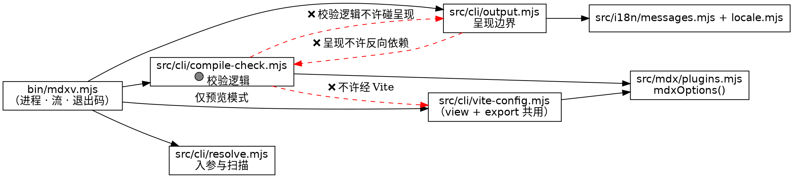

## Capability naming

新建 capability **`compile-check`**，而不是给 `cli-output` 加 delta。理由：`cli-output` 的
Purpose 自己划了界——「Scope is CLI-owned presentation only. It does not cover browser UI text
or **how command arguments are resolved into documents**」。本变更的载重部分（文档集解析、编译一致性、
退出码语义、流分工）正是它显式排除的东西，塞进去会撑破那个 capability 的定义。

报告行/汇总行的**呈现**确实属于 `cli-output`，但它们由新 capability 的要求驱动、且在
`src/cli/output.mjs`（既有的唯一终端呈现边界）里实现。help 页新增 `--check` 行与边界说明也一样：
规范写在 `compile-check`（因为「边界必须被写进 help」是 compile-check 的契约要求，见 R6），
`cli-output` 既有的「Standard command help」要求保持不变、不需要 MODIFIED delta——新增 section
是**加法**，不与「SHALL render help with Usage/Arguments/Options sections」冲突。

因此 spec 只有一份、且是 ADDED-only：`specs/compile-check/spec.md`。

---

## Four Contracts

### 1. Project structure & module design

```text
bin/
  mdxv.mjs                  ✏️ 薄接线：注册 --check，建 server 前分流
src/cli/
  compile-check.mjs         🟢 新增 · 校验逻辑（纯 I/O 边界，不碰进程与流）
  output.mjs                ✏️ 新增 formatCheckPath / formatCheckLine / formatCheckSummary
                                + help 的 --check 行与 Notes 段
  resolve.mjs               存量，不变（复用 resolveInput / scanTree）
  vite-config.mjs           ❌ 不动（view 与 export 共用）
src/mdx/
  plugins.mjs               ❌ 不动（mdxOptions 是被复用的输入，不是被改的对象）
src/i18n/
  messages.mjs              ✏️ 新增 cli.* 双语键
test/
  compile-check.test.mjs    🟢 新增 · 纯逻辑 + 子进程 CLI
  fixtures/compile-check/   🟢 新增 · pass / broken-jsx / broken-dot / boundary 样例
```

依赖方向（虚线 ❌ = 禁止方向）：



**职责边界**

| 模块 | 职责 | 明确不做 |
|---|---|---|
| `bin/mdxv.mjs` | 读 argv、分流、写流、设退出码 | 不含编译逻辑、不含格式化 |
| `src/cli/compile-check.mjs` | 读文件、经 `mdxOptions()` 编译、把失败归一为结构化结果 | 不 `console.*`、不 `process.exit`、不本地化、不格式化 |
| `src/cli/output.mjs` | 报告行 / 汇总行 / 路径显示 / help | 不读文件、不编译 |
| `src/cli/resolve.mjs` | `resolveInput` / `scanTree` | **本变更零改动** |

**`src/cli/compile-check.mjs` 公开面**（JSDoc 带类型，named export，kebab-case 文件名，
遵循 coding-guideline 的 JS 约定）：

```js
/** @typedef {{abs: string, ok: boolean, line?: number, column?: number, reason?: string}} DocumentCheckResult */

/** 把一次编译异常归一成可呈现的位置与原因（纯函数，无 I/O —— 便于单测覆盖三种异常形状）。 */
export function describeCompileFailure(error) // → {line?, column?, reason}

/** 顺序校验一批文档；每篇独立成败，不因单篇失败中断。 */
export async function checkDocuments(documents, { onResult } = {})
// documents: {abs: string}[]（直接吃 scanTree 的形状）
// → Promise<{results: DocumentCheckResult[], passed: number, failed: number}>
```

**公开面就这两个，没有第三个。** 特别是：**不要**加可注入的 `compileDocument`，
**不要**定义 `CompileEngineError`（第 2 轮复审的新发现，见 D7 —— 那条路径在方案 C 下不存在，
造出来只会是死代码 + 虚假覆盖）。校验逻辑与真实管线的一致性正是 R1 的全部价值，
一个「可替换编译函数」的接缝恰好是让二者漂移的机制，即便只对内也不该有。

`onResult` 回调让 `bin/mdxv.mjs` 边算边打印（长目录有进度感），同时保持 `checkDocuments`
自身不碰流。**其契约（F12）**：按输入顺序对每篇**恰好调用一次**；返回 thenable 则 await；
它自身抛出即中止整轮、归 exit 2（写不出报告 = 没能完成校验，不需要专门的错误类）；
返回的 `results` **只用于聚合**，调用方不得二次遍历打印——否则会出现重复行与顺序错乱。

**术语一致性**（glossary-conformance，本仓库无 `CONTEXT.md`，术语表在 `AGENTS.md`「术语表」）：
结果对象复用 `scanTree` 既有的 `abs` 字段名而非新造 `path` / `filePath`；`format*` / `resolve*` /
`is*` 前缀沿用既有 CLI 模块惯例。**一条 unregistered 项**：「编译校验（compile check）」是本变更引入的
新概念，术语表尚未登记 → docs-sync 节点补进 `AGENTS.md`「术语表」。（该检查只保证用词一致，
不构成设计正确性的任何credit。）

### 2. External protocol — the CLI contract

> 这是本变更的载重契约，且是**跨仓库**契约（`mdx-artifact` skill 会硬编码 flag 名、退出码与流分工）。

```text
mdxv --check <file|dir|demo> [--lang <zh-CN|en-US>]
```

**Flag 交互**

| Flag | `--check` 下的行为 |
|---|---|
| `--check` | 布尔开关，出现即进入校验模式 |
| `--lang <locale>` | **生效**（决定汇总行与错误文案的语言；优先级不变：`--lang` > `MDXV_LANG` > 系统 Locale） |
| `--port` / `--host` / `--no-open` | **接受但忽略**（校验模式不起 server；不报错，因为它们是 server 选项，报错只会打断 `ARGS=` 透传习惯）。可机检的不变量：不 bind 任何端口、进程自行退出 |
| `--help` / `--version` | 优先于 `--check`（沿用 `bin/mdxv.mjs:34-37` 与 `:110-112` 的既有早退路径） |
| 未注册选项 / 缺值 / 多余位置参数 | 用法错误 → exit **2**（见下） |
| `--lang` 非法 / 缺值 / 给两次 | 用法错误 → exit **2**（F3；注意这三种由 `bin/mdxv.mjs:27-33` 的 `resolveCliArguments` 在**任何 `--check` 感知之前**处理，现状退 1，必须改） |

> **保留命名空间**：将来所有 check 专属选项统一用 `--check-*` 前缀，这样 flag 命名空间能扩展而不必
> 再谈一次跨仓库契约（arch-review 的长期提示）。

**输入 → 文档集**（不使用 `pickDefaultDoc`；校验没有「默认文档」概念）

| 输入 | 文档集 |
|---|---|
| 文件 | 恰好该篇（`resolveInput(arg).target`） |
| 目录 | `scanTree(root)` 递归全部 `.md`/`.mdx`（按 `rel` 排序，跳过 `.` 前缀与 `node_modules`/`.git`/`dist` 等） |
| `demo` | `scanTree(DEMO_DIR)`——**必须忽略 target**（F11：`bin/mdxv.mjs:51-52` 给 `demo` 返回的 `{root, target}` 与「文件输入」**同形**，写成 `target ? [target] : scanTree(root)` 就会静默只校验 2 篇里的 1 篇） |
| 缺失 / 不存在 / 非 MDX 文件 / 空目录 | 用法错误 → exit 2 |

**退出码**

| 码 | 含义 | 消费方动作 |
|---|---|---|
| `0` | 文档集非空且全部编译通过 | 可以起预览、可以交付 |
| `1` | ≥1 篇未通过 | **文档破了** —— 修文档 |
| `2` | **无法执行校验** | **我调用错了** —— 修调用 |

exit 2 的完整清单：用法/参数级失败（含 `--lang` 三种，F3）、入参路径缺失/不存在/非 MDX、
**直接寻址的不可读文件**、空文档集。**没有第五项。**

> **引擎/资产故障不在 exit 2 里**（第 2 轮复审的结论，见 D7）。方案 C 下它们**必然**发生在
> per-document 编译内部，因此作为该篇的 `✗` 行计入 **exit 1**，判别手段是 reason 文本。
> 早期草稿曾把它们列进 exit 2 —— 那句话已删除；**不要照那个旧口径把它们接到 2 去**。

`2` 只在 argv 含 `--check` 时出现；不带 `--check` 的 `mdxv` 沿用既有 exit 1，
`cli-output` 的 S2 基线不回归。空目录归 2 而非 0 是**刻意的**：零文档静默通过正是本变更要消灭的
假门（agent 打错目录反而拿到绿灯）。

**一处刻意的不对称**（F7）：**直接寻址**的不可读文件退 2，而被扫描目录**内部**的不可读文件退 1
（D5）。理由：D5 的论据「其余文档确实被校验了」对单文件输入根本不成立——那种情况下一篇都没校验到，
正是 exit 2 的定义。`resolveInput` 的 `accessSync`（`src/cli/resolve.mjs:34-38`）天然产生前者。

**流分工**（消费方 grep 依赖它）

| 内容 | 流 |
|---|---|
| 逐篇 `✓` / `✗` 行、汇总行 | **stdout** |
| `Error: …`（+ 用法错误时的 help 页） | **stderr** |

即：报告是产品 → stdout；「我调用错了」→ stderr。消费方 `mdxv --check docs/ >report 2>err`
可以只 grep report，而 `err` 非空即表示调用姿势不对。这与既有预览/导出面板走 stderr 的做法不同，
理由见 D3。

**两条随之而来的强制约束**（都是 D3 的未处理后果，各自单独会毁掉可 grep 性）：

1. **着色必须按「实际写入的那条流」分别判定**（F2）。`bin/mdxv.mjs:24` 现在只有一个
   `const color = isColorEnabled({ isTTY: process.stderr.isTTY })`。而上面广告的那条调用里
   stdout 是文件、**stderr 仍是终端** → 复用现成 `color` 就会把 `✓` 写进 report。
   消费方随后会用一条 ANSI 剥离正则绕过去，那条正则就成了跨仓库契约的一部分。
   落地形式：在 `output.mjs` 导出 `resolveCheckColors({ stdoutIsTTY, stderrIsTTY, env })`
   → `{ report, diagnostic }`，让「两条流两个决定」进入模块公开面，实现者无法顺手退回单一 `color`；
   同时这让 S11 **不需要 pty** 就能断言（纯函数直接喂 `{stdoutIsTTY:false, stderrIsTTY:true}`）。
2. **不得调用 `process.exit()`**（F5）。stdout 是**管道**时 Node 写入是异步的，`process.exit`
   会丢弃排队数据；而校验模式恰恰通过 `onResult` 增量吐 N 行，长目录是高危形状。
   落地形式：设 `process.exitCode` 后正常返回，让 Node 自行冲刷。
   （「退出码正确 + 报告被截断」对一道门是最坏形状：消费方拿到 exit 1 和一份不完整的破损清单。）

**行格式**

```text
✓ <path>
✗ <path>:<line>:<column>  <reason>
✗ <path>  <reason>                 ← 异常不带位置信息时
<N> passed, <M> failed             ← 仅当文档集 >1 篇
```

- `<path>`：相对 `process.cwd()`；若相对形式会向上逃逸（以 `..` 开头）则打绝对路径。原样输出、不加引号、
  不着色，保持可复制粘贴（与 `cli-output`「preserve raw copyable paths」一致）。
- `<line>` / `<column>`：1-based，来自异常的 `line` / `column`（`VFileMessage`）。
- 位置与 `<reason>` 之间**两个空格**。
- `<reason>`：异常的 `reason`（无则 `message`）**完整**输出，不截断。BRIEF 样例里的
  `Unexpected character \`|\` (U+007C) in name` 是它的**前缀**——消费方 grep 该前缀依然命中，
  而尾部（`expected a name character such as …`）恰是可操作的部分。
- `✓` / `✗` 按 `isColorEnabled()` 着绿/红；路径与 reason 不着色。
- 顺序 = `scanTree` 的 `rel` 排序；顺序执行、边完成边打印。

**实测的三种异常形状**（决定了上面为什么必须有「无位置」分支）

| 触发 | 异常类 | `line`/`column` | `reason` |
|---|---|---|---|
| 行首 `<global\|tenant\|workspace>` | `VFileMessage` | `2` / `8` ✅ | `Unexpected character …` |
| 未闭合 `<Callout>` | `VFileMessage` | `undefined` ⚠️ | `Expected a closing tag for \`<Callout>\` (3:1-3:10)` |
| 坏 `dot` 围栏 | 裸 `Error` | 无 | `syntax error in line 2`（**dot 源的行号，不是 MDX 的**） |

另注：异常的 `error.file` 实测为 `""`（即使 `process({path})` 传了 path），故**路径必须由调用方
自己带上**，不能读 `error.file`。

**这道门承诺什么、不承诺什么**（F4——原措辞「pass ⇒ guaranteed to be openable」字面不成立，已收紧）

这道门是**单向可靠**的，把这件事写清楚比含糊过去更有用：

| 方向 | 强度 |
|---|---|
| **失败 ⇒ 一定渲染不出来** | sound（依赖 D7 成立：工具故障必须归 2，否则 exit 1 不再唯一意味着「文档破了」） |
| **通过 ⇒ 编译期无错** | necessary but **not** sufficient |

「通过」实际保证的是：语法可解析、frontmatter 是合法 YAML、`dot`/`graphviz` 围栏**真的**在编译期
经 graphviz-wasm 成图（`src/mdx/diagrams.mjs` 就在编译期喂 wasm，坏图确实被挡——这条保证不小，
收紧措辞时别丢）。它**不**保证文档能加载。两档非检出：

| 档 | 后果 | 判据 |
|---|---|---|
| **甲** | 页面能打开，只是不对 | 未定义组件（渲染期清晰报错）、非法属性值（静默失效）、坏公式（KaTeX 渲染错误节点） |
| **乙** | **整篇加载 / 渲染失败** | **机制**：任何**顶层 ESM 语句**或 `{…}` 表达式在**模块求值 / 渲染期**失败 —— 例如 specifier 无法解析、标识符未定义、**或初始化器自身抛错** |

help 文案必须**点名乙档**——乙档才是击穿「过了就能交付」这个用法的那一类。

**乙档必须写成「机制 + 举例」，不能写成封闭枚举**（code-review #A3；用户裁定本轮就改）。
理由不是原措辞说了假话（help 的引导句「只校验编译、不保证能加载」本身是真的），而是**一份没有
「例如」标记的两项枚举会被理性消费方读成穷举**，进而推出「我这篇既没 import 也没 `{…}`，
那么通过 = 可交付」——而打掉这个推理正是本要求存在的全部目的。反例（实测）：

```text
export const boom = (() => { throw new Error("x") })()   → --check 退 0，浏览器里模块求值即炸
{(() => { throw new Error("y") })()}                      → --check 退 0，渲染期即炸
```

乙档的机制天然开放：**每一种乙档形状都按定义在编译期不可见**，所以任何枚举都不可能完备。

**乙档内部还有一道分界，影响能断言什么**（实测，2026-07-28）：

| 乙档形状 | `--check` | `mdxx` | 失败时机 |
|---|---|---|---|
| specifier 无法解析 | 0 | **1** | 构建期（Vite 解析） |
| 顶层初始化器抛错 | 0 | **0** | 模块求值期（浏览器） |
| `{…}` 表达式抛错 | 0 | **0** | 渲染期（浏览器） |

即：只有**构建期子集**能被 `mdxx` 见证；求值期子集**两条命令都放行**，`mdxx` 甚至会产出一个
「打开就炸」的 HTML。所以 **S14 的配对断言只能覆盖构建期子集**（别把它扩到求值期形状去——
那样断言就是假的），求值期子集由 **S20** 用「两条命令都退 0」配对钉住。

**乙档措辞的一处关键纠正**（用户提出、控制器与我各自实测确认）：必须写「**顶层 ESM `import` 语句**」，
**绝不能**写成笼统的「import」。围栏代码块里的 `import` 是**惰性文本**，不是 ESM 语句：

```text
顶层 import Thing from "./does-not-exist.js"   → mdxx exit 1   （乙档，真的打不开）
```js 围栏里的两行 import                       → mdxx exit 0   （完全正常）
```

「写文档来讲 JavaScript」是本项目的主要用法之一，措辞不得把它牵连进去。

**给将来可能的加宽留的设计注记**：若日后要让 `--check` 也校验 specifier 可解析性（本轮已由用户
定为不做，见 D6），实现**必须**读 `mdxjsEsm` AST 节点，**绝不能**文本 grep `^import`——文本 grep 会把
每一份含 JS 围栏的文档误判为失败，与 F1 是同一类**假失败**事故。

### 3. Database design

**不适用。** 本项目无数据库、无持久化、无 DDL、无迁移、无 ORM。`--check` 也不写任何本地文件
（不落 HTML、不落缓存、不落临时目录）——「零产物」本身是 R5 的可机检要求。

### 4. Use cases & e2e scenarios

**执行载体：scripted —— `node --test`，子进程 CLI + 纯函数单测。不用 Playwright**（本变更零浏览器面）。
完整清单见 `specs/compile-check/spec.md`：**19 个场景 S1–S16 / S18–S20**（S1–S12 为初版；
第 1 轮 arch-review 后新增 S13 format 双向、S14 乙档配对、S15 管道不截断、S16 demo 篇数，
并把原 S10 那一个「三种非检出捆在一个断言」的场景拆成 S10 / S18 / S19，见 F8。
**S17 已删除**：第 2 轮复审发现它测的是方案 C 下不存在的路径，见 D7。
**S20 为 code-review #A3 后新增**：钉住乙档求值期子集「两条命令都放行」，见上 §2 的分界表）。

**两个文件、两条车道**：

| 文件 | 车道 | 内容 |
|---|---|---|
| `test/compile-check.test.mjs` | 快（进 `test:unit` 清单） | S1–S11、S13–S19：纯函数 + 子进程 CLI，无 Vite 构建 |
| `test/compile-check-perf.test.mjs` | 慢（**不进** `test:unit`） | 仅 S12：要跑真实 `mdxx` 构建 |

登记提醒（AGENTS.md 明写的坑）：快车道文件必须加进 `package.json` 的 `test:unit` **显式清单**，
否则 `make test-unit` 跑不到它；`npm test` 的 `test/*.test.mjs` 通配会把两个文件都带上。

---

## Key decisions (ADR)

### D1 · 逐篇 `compile({path, value}, mdxOptions())`——format 由库自己按扩展名推导 · accepted

**上一版这条是错的**（arch-review F1，P0）。上一版选「`createProcessor(mdxOptions())` 建一次复用」，
而 `mdxOptions()` 不含 `format`，`createProcessor` 默认 `'mdx'` → **每一篇都按 MDX 解析，包括 `.md`**。
真实管线不是这样：`vite-config.mjs:65` 的 `mdx(mdxOptions())` → `@mdx-js/rollup` →
`createFormatAwareProcessors`，它**逐文件**按扩展名推导 format，而 `@mdx-js/mdx` 内部
`if (settings.format !== 'md') pipeline.use(remarkMdx)` —— **`.md` 根本不过 MDX 解析器**。

我独立复现（同一份 `mdxOptions()`，同一份内容，只改扩展名与调用方式）：

| 内容 | 扩展名 | `createProcessor` 复用 | `compile({path})` | `createFormatAwareProcessors` |
|---|---|---|---|---|
| 行首 `<global\|tenant\|workspace>` | `.md` | **FAIL** ❌ 假失败 | OK ✅ | OK ✅ |
| 同上 | `.mdx` | FAIL ✅ | FAIL ✅ | FAIL ✅ |
| `A <not_a_tag> here` | `.md` | **FAIL** ❌ 假失败 | OK ✅ | OK ✅ |

**为什么这条最贵**：`scanTree` 的 `INDEX_NAMES` 本身就含 `README.md`，「目录里有普通 `.md`」是
**默认情况**。而对一道门来说**假失败比假通过更坏**——它拦住正常产物，并训练调用方忽略这道门。

| 备选 | 利 | 弊 |
|---|---|---|
| 裸 `compile(source)`（无 path） | 快 | 门是假的：插件全不参与，且**无扩展名可推导** |
| ~~`createProcessor()` 建一次复用~~ | processor 建一次 | **上一版的缺陷：format 恒为 mdx，`.md` 假失败** |
| A: `internal-create-format-aware-processors` | 与 rollup 插件同一入口，天然对齐 | 依赖一个 `internal-*` 子路径导出 |
| B: 自建两个 `createProcessor` 按扩展名分派 | 不碰非公开入口 | 自己维护扩展名→format 映射（一份可漂移的复制品） |
| **✅ C: 逐篇 `compile({path, value}, mdxOptions())`** | **纯公开 API**；format 由库按 path 推导，零复制；顺带消灭 F10 那条不可观测的 SHALL | 代价：每篇重建 processor（**实测为零**，见下） |

**选定 C 而非 reviewer 建议的 A / B**，因为它同时避开 A 的 `internal-*` 依赖和 B 的映射复制
（复制品会漂移，正是 CLAUDE.md「双端一致」要防的东西），且 `compile()` 内部就是
`resolveFileAndOptions` + `createProcessor`——与 rollup 侧同一套推导。

**「每篇重建 processor」的代价实测为零**：per-doc `compile()` = 140 / 4 / 32 / 23 ms，
reused processor = 137 / 3 / 32 / 24 ms（同四篇真实文档，同一台机）。因为暖机成本在
**模块级**缓存里——`diagrams.mjs` 的 `graphvizPromise` 是模块作用域，shiki highlighter 也由
`rehype-pretty-code` 内部缓存——与 processor 对象无关。所以上一版「建一次」既不必要、又是错误的来源。

**输入形状**：`compile({ path, value }, …)` 传**普通对象**即可，库会自行包成 VFile 并从 `path` 推导
format——因此**不需要**把 `vfile` 提成直接依赖（它目前只是传递依赖）。已实测通过。

**刻意不对齐的旋钮**（不能笼统说 "same options"）：rollup 包装层还注入 `SourceMapGenerator`
（仅诊断用）并从 Vite mode 推导 `development`（`mdxv` dev → `true`，`mdxx` build → `false`
——**两条既有路径本来就不一致**，故它不可能是 parity 要求）。二者都不改变 pass/fail；
必须对齐的只有 `format`。

### D2 · 用法错误用 exit 2 · accepted

| 备选 | 利 | 弊 |
|---|---|---|
| 全部失败都 exit 1 | 与既有 `mdxv` 一致 | 消费方分不清「文档破了」和「我调用错了」——前者要修文档，后者要修调用，动作完全不同 |
| **✅ 校验失败 1 / 用法错误 2** | 消费方可分流；`grep`/`diff` 早有此惯例 | **代价**：`mdxv` 内部出现两套退出码语义（仅 `--check` 下为 2），需要在 spec 与 help 里讲清 |

### D3 · 报告走 stdout，而既有面板走 stderr · accepted

| 备选 | 利 | 弊 |
|---|---|---|
| 报告也走 stderr | 与 `formatPreviewSuccess` / `formatExportSuccess` 一致 | 报告与「调用错了」挤在同一条流，消费方无法只靠重定向分离；也不合 lint 类工具惯例（eslint/tsc/ruff 的 findings 都在 stdout） |
| **✅ 报告 stdout / 用法错误 stderr** | `>report 2>err` 天然分离；`err` 非空 = 调用姿势错 | **代价**：`mdxv` 内两种模式的流分工不一致 |

理由：既有面板走 stderr 是因为它是「server 已起来」的**状态旁白**（stdout 留给未来的数据输出）；
`--check` 的报告是这条命令的**主产物**，不是旁白。

### D4 · 汇总行仅在文档集 >1 篇时打印 · accepted

严格复现 BRIEF 里用户确认的两个样例（单文件只有 `✓ doc.mdx`，目录才有 `2 passed, 1 failed`）。
**代价**：输出形状随文档数变化，消费方**必须以退出码为准**，不能靠汇总行存在与否判断。
规范里把这点写成显式约束。

### D5 · 目录内不可读文件计为「失败」；直接寻址的不可读文件计为「无法校验」 · accepted

被扫描目录**内部**存在但读不出的 `.mdx`（如 EACCES）打 `✗ <path>  <OS reason>`、计入 `failed`、exit 1。
理由：门的语义是「这条路径下每篇都是已知良好的」，读不出来的那篇**不是**已知良好，门不能放行；
而 exit 2（「没能执行校验」）不成立，因为其余文档确实被校验了。
**代价**：消费方看到 exit 1 会以为是文档语法问题，实际是环境问题——reason 文本负责区分。

**但直接寻址**（`mdxv --check ./that-one-file.mdx`）的不可读文件退 **2**（F7）：此时上面那句论据
反过来了——一篇都没校验到，正是 exit 2 的定义。`resolveInput` 的 `accessSync` 天然产生这个分叉；
本轮把它**写下来**，让不对称读起来是刻意的而非漏网。

### D6 · 不做的三件事 · accepted（OQ1 由用户裁定为方案甲）

`--json` 输出（无实际消费方，避免投机扩展）、给 `mdxx` 加同名 flag（一处足够）、
改 `plugins.mjs` / `vite-config.mjs`（CLAUDE.md 硬约束）。

**加上第四件**：arch-review 的 OQ1（是否把门加宽到「模块 specifier 可解析」）由用户裁定为
**方案甲——`--check` 保持 compile-only**。所以 F4 纯靠「收紧承诺 + 两档边界文档化 + S14 配对断言」
落地，不加宽射程。**代价**：乙档第一项仍是一个真实的漏放通道，由消费方承担；
将来若要加宽，见 §2 末尾那条 `mdxjsEsm` 设计注记。

### D7 · 引擎故障留在 exit 1，靠 reason 文本区分；不设专门退出码、不建接缝 · accepted（第 2 轮改写）

校验会在编译期把文档喂给 graphviz-wasm 与 shiki。若这些引擎/资产加载失败（离线、装坏、OOM），
会**逐篇** reject → 计入 `failed` → 退 1，而 reason 与文档内容毫无关系。这是一条**误诊通道**：
调用方可能被送去改一批本来没问题的文档。上一版据此把这类故障路由到 exit 2，并为此设计了
`CompileEngineError` + 可注入的 `compileDocument`。

**第 2 轮复审推翻了这个设计，理由成立**：方案 C（逐篇 `compile()`）之后，
「per-document 编译**之外**的故障」这个集合**不是窄，而是空的**——我逐一核对过：

| 故障 | 实际发生位置 | 归档 |
|---|---|---|
| 编译管线构建失败 | `compile.js:38-39` 在**每次调用内**做 `resolveFileAndOptions` + `createProcessor` | per-doc → 1 |
| graphviz-wasm 加载失败 | `diagrams.mjs:79` 的 `await getGraphviz()` 在 `:64` 返回的 transformer 内 | per-doc → 1 |
| shiki highlighter 创建失败 | `rehype-pretty-code` 在 attacher/transformer 内建 highlighter | per-doc → 1 |
| 插件包本身损坏 | `compile-check.mjs` **import 期**就抛，早于 `checkDocuments` | CLI 启动崩溃 |
| `mdxOptions()` 抛错 | 纯对象字面量、引用的插件在 import 期已加载 → **不可能抛** | —— |

所以 `CompileEngineError` 在生产中**永远不会被抛出**，S17 只能靠注入的测试替身通过。
那是一条「测的是现实中无法触发的路径」的场景——**虚假覆盖**。

**选定**：**不设第三档语义、不定义 `CompileEngineError`、不建注入接缝。** 引擎故障作为该篇的 `✗` 行
计入 exit 1，**判别手段是 reason 文本**（与 D5 处理 EACCES 的既有先例一致）。S17 已删除。
**代价**：F6 想关掉的那条误诊通道**其实还开着**，本变更诚实地承认而不是假装修好了。

**为什么这对 F4 是充分的（第 2 轮复审同时修正了它自己第一轮的推理，这条论证不能漏）**：
校验与真实管线**共用同一个 `plugins.mjs`**（正是 CLAUDE.md 那条双端一致硬约束）。
所以 graphviz-wasm 在某台机器上装坏时，`mdxv` 预览与 `mdxx` 导出**在同一台机上也编译不出这篇**——
文档确实打不开。**F4 的「失败 ⇒ 一定打不开」因此仍然为真**；坏掉的是**归因**
（报告让人以为是文档内容的错），不是保证本身。残余只剩非系统性的一类（一次性 OOM、
大批量下的资源上限），任何门都有这一类，规范消除不了。

**刻意不做的启发式**：「≥2 篇全部以同一条非位置 reason 失败即判工具故障」——它在**不安全的方向**
上出错：会把一个真实的「整个目录都坏了」翻译成 exit 2（「你调用错了」），
而把 2 当作「与我无关、可重试」处理的消费方会**静默放行一批真破损文档**。

---

## Cross-cutting quality

- **兼容与互操作（Compatibility & Interoperability）**：当跑完既有全部套件（`resolve` / `cli-output` /
  `mdx-pipeline` / `export` / 三个 Playwright spec），**全部继续通过**，且 `mdxv <file>` 预览与
  `mdxx <file>` 导出的行为字节级不变。度量：`plugins.mjs` / `vite-config.mjs` / `resolve.mjs` /
  `bin/mdxx.mjs` 的 diff 为空。权衡：`--check` 因此不能顺手「修正」共享管线的任何行为。
- **性能与容量（Performance & Capacity）**：本变更**存在的理由**就是快。
  **被断言的判据只有相对倍数**（硬件无关）：同一次会话内，`--check` 单篇满特性文档
  （`examples/demo.mdx`：frontmatter + KaTeX + dot + mermaid + GFM + shiki）耗时 ≤ `mdxx`
  同文件的 **1/5**。**绝对秒数只作记录在册的预算/基线，不进测试断言**（F9：上一版 spec 断绝对秒数，
  与 `tasks.md` 自己写的「只断相对倍数，避免机器差异导致 flaky」直接矛盾）。
  本机基线（2026-07-27）：单篇 0.30 s、4 篇目录 0.33 s、`mdxx` 同文件 3.77 s（≈12.5×）；
  预算取单篇 ≤1.0 s、4 篇 ≤1.5 s，供 perf-gate 参考。
  **测试车道**：S12 要跑一整轮 `mdxx` Vite 构建（约 3.8 s + 写临时 HTML），**必须留在慢车道**
  （与 `test/export.test.mjs` 同侧），不得进 `test:unit`——否则 `make test-unit` 会静默变成一条 5 秒命令，
  违背 AGENTS.md 对该车道「快、无 vite 构建」的承诺。
  权衡：暖机成本落在首篇（后续篇 3–32 ms），故预算按「首篇成本 + 边际成本」而非纯线性给。
- **失败与一致性（Failure & Consistency）**：当某篇抛出无位置信息的异常（坏 dot / 未闭合标签），
  报告**降级为 `✗ <path>  <reason>`** 而非崩栈或伪造位置；当某篇失败，**其余文档继续校验**。
  度量：单篇失败不影响其余行的产出，且 stderr 无 stack（沿用 `cli-output` 的 no-stack 要求）。
- **安全与信任边界（Security & Trust Boundary）**：`--check` 只**读**磁盘文件、不执行文档里的代码
  （`compile()` 只编译不 `run()`，MDX 里的表达式与 import 不求值）、不起监听、不出网。信任边界与
  既有 `mdxv` 一致：CLI 参数与文件内容都是不可信输入，路径经 `resolveInput` 的 `statSync`/`accessSync`
  把关。度量：校验过程零端口 bind、零文件写入、零网络请求。
- **可观测性（Observability）**：单命令 CLI，无需指标/日志设施；可观测面就是报告行 + 退出码
  ——三档退出码即本变更的全部「遥测」。故不触发 middleware-guideline 的监控面要求（无后端服务、
  不读配置中心）。

---

## Arch-review disposition（2026-07-27 第一轮，`arch-review.md`）

全部 13 条 finding 均已消化进 spec；无一条被静默丢弃。下表供复审逐条核对。

| # | 严重度 | 落点 |
|---|---|---|
| **F1** | 🔴 P0 | R1 重写（format 按扩展名逐篇推导 + 列出刻意不对齐的旋钮）· 新增 **S13** · D1 重写 · tasks 1.3 |
| **F2** | 🔴 P0 | R7 重写（着色按实际写入的流分别判定）· **S11** 收紧 · §2「两条强制约束」1 · tasks 2.5 |
| **F3** | 🟠 P1 | R4（`--check` 在场时一切参数级失败退 2，含 `--lang` 三种）· **S6** 补 WHEN · tasks 3.1 |
| **F4** | 🔴 P0 | R1 承诺收紧为单向 · R6 重构为甲/乙两档 + help 点名乙档 · 新增 **S14** 配对断言 · §2「这道门承诺什么」 |
| **F5** | 🟠 P1 | R4（设 `process.exitCode`、禁 `process.exit()`）· 新增 **S15** · §2「两条强制约束」2 |
| **F6** | 🟡 P2 | **第 2 轮推翻并重做**：R4 明写引擎故障留在 exit 1（判别靠 reason 文本）· **S17 删除** · D7 改写（空集论证 + 共用引擎论证 + 拒绝启发式）· 不建 `CompileEngineError` / 注入接缝 |
| **F7** | 🟡 P2 | R4（不对称显式成文）· **S6** 补 WHEN · D5 改写为「目录内 1 / 直接寻址 2」 |
| **F8** | 🟡 P2 | 原 S10 拆成 **S10 / S18 / S19**，每档非检出各自可钉 |
| **F9** | 🟡 P2 | R8 改为**只断相对倍数**、绝对秒数降级为记录预算 · S12 移入慢车道（独立测试文件） |
| **F10** | 🟡 P2 | 随 F1 一并消失——新 R1 不再提 processor 构建方式（实测证明「建一次」本无收益） |
| **F11** | 🟡 P2 | R2（`demo` 必须忽略 target）· 新增 **S16**（断言恰好 2 篇并点名两者）· tasks 3.2 |
| **F12** | 🔵 P3 | §1 公开面补 `onResult` 契约（恰好一次 / 按序 / await thenable / 抛出即归 2 / `results` 不二次打印） |
| **F13** | ⚪ 建议 | Makefile 目标改名 `check-mdx`（避开 GNU `check` = 跑测试的惯例）+ 登记 `.PHONY` · tasks 4.4 |

**三处我按不同方案落地（比建议更优或范围受限），特此说明：**

1. **F1 的实现路径选 C，而非 reviewer 建议的 A 或 B。** A 依赖 `internal-*` 子路径导出；
   B 要自建一份扩展名→format 映射（可漂移的复制品，正是本仓库一直避免的）。
   C（逐篇 `compile({path, value}, mdxOptions())`）是纯公开 API、零复制，且我实测确认
   「每篇重建 processor」的开销为零（详见 D1 的对比数字），所以 A 的主要卖点（processor 复用）
   本就不是真收益。
2. **F2 的落地形式加了一个命名导出** `resolveCheckColors({stdoutIsTTY, stderrIsTTY, env})`。
   reviewer 只要求「按流判定」；但若只写在散文里，实现者复用现成 `color` 仍是最省事的写法，
   且断言它需要 pty（本仓库零第三方测试依赖，起不了 pty）。把决定提升成纯函数后，
   S11 无需 pty 即可断言，且实现者无法顺手退回单一 `color`。
3. **F6 只路由「能确定分辨的那一类」。** per-document 的引擎错误与内容错误异常形状相同，
   无法可靠区分；更激进的启发式（如「全篇同因失败即判工具故障」）会把真实的「整目录都坏了」
   误判成工具故障。故只把 per-document 编译**之外**抛出的故障归 2，并在 D7 里明记这条极限。

**用户裁定（不在本轮 review 权限内）**：OQ1 → **方案甲**，`--check` 保持 compile-only，
不加宽到 specifier 解析。相应地 F4 纯靠措辞收紧 + 边界文档化落地。见 D6。

### 第 2 轮复审（2026-07-28）：✅ GO，另收一项新发现

四项 blocking 全部核对通过；三处偏离**全部接受**，其中 F1 的方案 C 与 F2 的 `resolveCheckColors`
被判**严格优于**复审原本的建议（复审独立复跑了那条支撑性测量：边际 ~1.6 ms/篇、50 篇约 80 ms、
逐篇耗时平坦无累积泄漏，结论成立）。复审同时**修正了它自己第一轮的推理**：因共用 `plugins.mjs`，
F4 的保证在 F6 收窄后仍然为真（论证已并入 D7）。

**唯一新发现（P2，本轮已消化）**：F1 的处置抽空了 F6 的触发面 —— 见改写后的 D7。落地三处：
R4 改写、S17 删除（19 → **18** 个场景）、`CompileEngineError` 与注入接缝**不建**。
留一条负向指令在 tasks 1.5，防止实施时按旧稿把接缝造出来。

**刻意留给下游、本轮不动的两条**（复审明确未要求修，路由到后续门）：

1. **S11 只钉住着色的判定逻辑、钉不住接线** —— 唯一能暴露错接线的环境（stdout 管道 + stderr TTY）
   需要 pty，而本仓库零第三方测试依赖。→ 交 **code-review** 作为显式条目：读 `bin/mdxv.mjs` 的两处
   `colorize` 调用，确认报告取 `.report`、诊断取 `.diagnostic`。不为此引 pty 依赖，
   也不为此把 check 接线从 `bin/` 抽成可导入模块（收益不抵结构改动）。
2. **边际单篇成本无断言**（R8 只断单篇比值）→ 交 **perf-gate** 记录边际基线。

### Code-review 后的文本修订（2026-07-28）：#A2 / #A3

`code-review` 两项判定均 HELD、零 P0/P1；两条 P2 属**本文件与 spec 的文本**，已改：

| # | 问题 | 落点 |
|---|---|---|
| **#A2** | §2 的 exit-2 清单与自己的 D7 相互矛盾（仍把引擎/资产故障列进 exit 2，是第 1 轮的残留句） | exit-2 表格与清单收敛为「无法执行校验」四项 + 显式「没有第五项」+ 一条**反向提示**，防止将来有人照旧口径把引擎故障接到 2 去。实现跟的是 `spec.md`，本来就是对的 |
| **#A3** | 乙档读作**封闭集**，支撑「没 import 就通过 = 可交付」这个不成立的推理；且漏了「初始化器抛错」「`{…}` 求值抛错」两个同类形状 | 乙档改写为**机制 + 举例**（spec R6 / 本文件 §2 / `REVIEW.mdx` 三处同步），补上实测反例，补上**构建期 / 求值期分界表**，新增 **S20**。保住两件硬来之物：「顶层 ESM 语句」措辞 + 围栏惰性说明；S14 的配对断言与第二份 fixture |

**#A3 顺带纠正了一个我原先没写明的事实**：乙档并非「`mdxx` 能兜住」——只有**构建期子集**能。
求值期子集两条命令都退 0，`mdxx` 还会产出一个「打开就炸」的 HTML。这一点现在写进了 spec R6
（禁止把针对 `mdxx` 的配对断言扩到求值期子集）。

未由本文件处理、已路由出去的两条：**#A1**（`--check=true` 绕过裸 argv 探测）与 **#A4**
（docs-sync 未做，README 零处提及 `--check`）不属 planner 写作权限——前者是 `developer` 的
`bin/mdxv.mjs`，后者见 tasks 5.3。`cli.checkBoundaryNote` 双语文案的新措辞由 planner 给出、
交 `developer` 落地（见本轮返回）。
