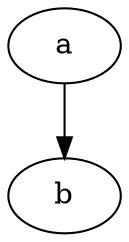
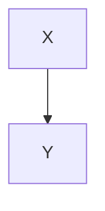

# Full feature

GFM table:

| A | B |
|---|---|
| 1 | 2 |

- [x] done
- [ ] todo

~~strikethrough~~

Inline math $E = mc^2$.


```dot
digraph { a -> b }
```


```mermaid
graph TD; X-->Y
```

```ts
export const answer: number = 42;
```
