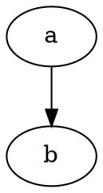
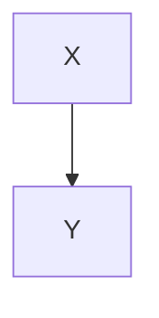

# Heading

Inline math $E = mc^2$ works, alongside a GFM table:

| A | B |
|---|---|
| 1 | 2 |

~~struck~~


```dot
digraph { a -> b }
```


```mermaid
graph TD; X-->Y
```

```ts
const answer: number = 42
```
