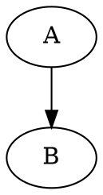

# Export Sample

Inline math $a^2 + b^2 = c^2$, plus a highlighted code block:

```ts
const answer: number = 42
```

A build-time diagram, so the export test can pin diagram theming against the real
artifact rather than only against the inlined stylesheet. `dot` is deliberate: it is
rendered at build time and adds no runtime, unlike `mermaid`.



Self-containment smoke fixture.
